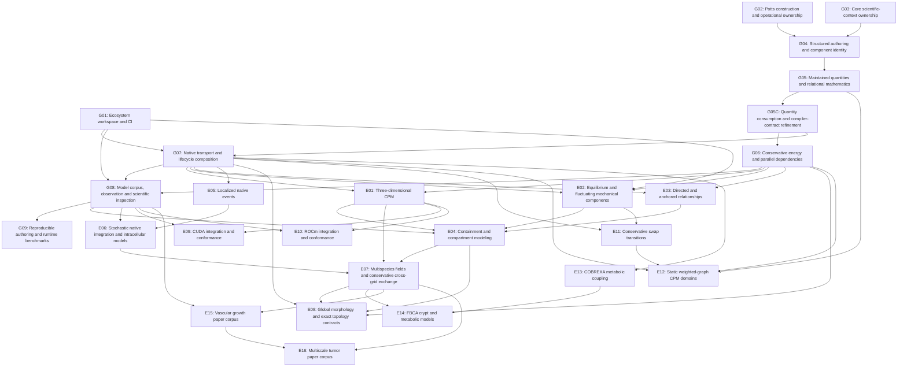

# Consolidated PR dependency map

Status: User-approved delivery allocation, not opened PRs or new authorization
to publish/merge. Prepared 2026-09-08; amended 2026-09-10.

## 1. The concrete allocation

**54 planned repository PRs in 26 delivery groups: 22 main-spine PRs and 32
breadth PRs.** The allocation includes the user-approved Core/Potts compiler
pair R49/R50 in G05C and adds R51–R54 for COBREXA integration and scientific
model deliveries. Existing R01–R50 identities are unchanged. This remains a
dense delivery model, not a guaranteed
final count or a ceiling on scientific discoveries.

The 2026-09-09 [compiler-contract amendment](compiler-contract-chain-amendment.md)
records the shared agent-facing scope, defending cases and ownership. These
improvements are accepted into the delivery plan, not claimed implemented.

The user accepted the [composition-first model amendment](composition-first-model-roadmap.md)
on 2026-09-10 and confirmed **COBREXA.jl** as the metabolic dependency. Its
existing-owner changes, direct cutovers, fourteen model witnesses and four
additional deliveries are accepted scope. Read it alongside this map before
selecting affected work; explicitly unresolved scientific details remain open.
Approval of scope is not implementation evidence.

Implementation has identified eight required additional PRs:

- A **G04 LocalMath companion for immutable named-product and nested-record
  storage/publication**. It supplies the actual R08 structured-state consumer;
  it is not a second executor or a new feature outside the existing scope.
- A **G01 PottsModels CI companion**, [Models PR2](https://github.com/PraneethMerugu/PottsModels.jl/pull/2),
  allowing cold dependency setup and strict executable tutorials to complete.
  The original merged-main job passed its model tests but reached its one-hour
  timeout during tutorial dependency compilation. This companion changes only
  the job timeout, preserving the original tests and documentation requirements.
- A **G04 LocalMath execution-prerequisite companion**,
  [LocalMath PR13](https://github.com/PraneethMerugu/LocalMath.jl/pull/13), for the demonstrated
  floating-point sine admission gap and canonical Collect preparation bounds
  failure on Metal. These unblock real polarity and structured lifecycle
  consumers. Both implementations now share one reviewed repository PR with
  separate ordinary owner tests, full local CPU/Metal validation, scientific
  witnesses and strict documentation. It merged after hosted checks passed;
  this is not a new executor or permission to relax device safety checks.
- A **G05 LocalMath fixed-value effect-analysis companion**,
  [LocalMath PR14](https://github.com/PraneethMerugu/LocalMath.jl/pull/14),
  preserving immutable `StaticArrays.SArray` payloads during exact typed-effect
  analysis while retaining host surrogates for physical arrays. This is the
  demonstrated reusable prerequisite for vector/tensor maintained sums; it
  keeps the canonical Reduce executor and exact result-type contract.
- A **G05 LocalMath backend-owned array-allocation companion**,
  [LocalMath PR16](https://github.com/PraneethMerugu/LocalMath.jl/pull/16),
  because the real Core structured-sum
  consumer demonstrated that generic `copyto!` from an ordinary host view into
  Metal storage attempts forbidden scalar device indexing. The correction keeps
  CPU copies on Base, uses KernelAbstractions' backend transfer for supported
  physical arrays, and stages unsupported host views through independent dense
  host storage. It does not claim untested CUDA, ROCm, or custom-array support.
- A **G05 LocalMath identity-seeded reduction-control companion**,
  [LocalMath PR17](https://github.com/PraneethMerugu/LocalMath.jl/pull/17). The real
  lifecycle maintained-minimum consumer demonstrated that a field produced by
  `Reduce(...; seed = IdentitySeed(...))` cannot currently serve as the total
  field-derived gate for a following stage: planning asks every publication law
  for `coverage`, a property owned only by `Unique`. An identity seed initializes
  every reduction destination even when no contribution is routed, so this
  companion gives LocalMath one total-publication predicate for planning,
  admits that exact reduction case, retains rejection for `ExistingSeed`, and
  defends stale-gate reset plus open/closed execution on CPU and Metal. It
  extends the sole LocalMath planner/executor rather than adding a Core-specific
  gate path. Full local CPU, Metal, documentation, and independent review
  evidence passed before merge; every applicable hosted package, docs,
  scientific, macOS-smoke, and Metal check also passed post-merge.
- A **G07 LocalMath ordered-fold step-validation companion**,
  [LocalMath PR18](https://github.com/PraneethMerugu/LocalMath.jl/pull/18),
  merged after local CPU, real-Metal and independent-review qualification; its
  complete post-merge hosted package, scientific, docs, macOS-smoke and Metal
  run also passed. The real bounded
  finite-resource exchange design can reuse LocalMath's public `OrderedFold`
  for canonical contention, evolving availability, heterogeneous paired writes
  and failure-atomic publication, but its transition result currently has no
  semantic channel for a computed invalid step. Add only generic recurrence
  validity plus a bounded diagnostic witness before scratch updates are applied;
  keep ordinary allocation denial as a valid published disposition. Core R14
  owns transfer identities, requested/realized amounts, availability/capacity,
  conversion, conservation, lifecycle accounting and user-facing status. This
  implementation does not introduce a LocalMath transfer API, allocator
  framework, native concept or second executor.
- A **G05 LocalMath exact keyed-reduction companion**, ordered after LocalMath
  PR18 and before Core R10/Potts R11 completion. The real maintained spatial-
  query design demonstrated that existing destination grouping can combine
  contributions only after Core already owns a dense `Int32` destination. It
  cannot exactly group sparse generation-aware owner-pair keys without either
  an O(C²) directory or collision-unsafe hashing. Add one fixed-capacity
  `KeyedReduce` publication law over the existing `Collection`/
  `CompactedStorage` authority: unique stage-entry keys, exact canonical key
  order, canonical left-fold contribution order, private O(M+C) workspace,
  identity-key removal, capacity validation and one failure-atomic publication
  gate on the shared KernelAbstractions path. Capacity remains runtime data;
  kernels specialize only on bounded key/value/operation/emission and retention
  families. Do not add a Potts query vocabulary, hash semantics, relaxed fold,
  registry or second collection executor. Core R10 consumes this primitive for
  exact O(E) pair multiplicity; Potts R11 lowers the existing
  `ResourceOperation` surface to that Core authority.

The current identified allocation is therefore **62 repository PRs: the 54 planned
PRs below plus these eight companions**. R49–R54 are counted once in the 54;
the existing LocalMath companions are not counted again as compiler work.
Further demonstrated companions can still increase the count.

The [feature plan](authoring-and-model-ecosystem-plan.md) and
[ideal authoring spec](../spec/ideal_api_vision.md) continue to define scope and
scientific requirements. This document owns the accepted grouping, dependency
map and count. P01–P16 and B1–B8 remain coverage labels, not additional PRs to open
on top of this map. R01–R54 are planning identifiers, not existing GitHub numbers
or prescribed branch names; their numbering is not a chronological merge order.

| Repository | Main spine | Breadth | Planned total |
| --- | ---: | ---: | ---: |
| Potts.jl | 8 | 13 | 21 |
| CorePotts.jl | 7 | 9 | 16 |
| LocalMath.jl | 1 | 2 | 3 |
| MakiePotts.jl | 2 | 0 | 2 |
| PottsModels.jl | 4 | 8 | 12 |
| **Total** | **22** | **32** | **54** |

### Accepted composition-first changes to existing owners

- G04/R08–R09 owns MTK-like component authoring, shared parameters, scoped
  references, structured state/history and ordinary constructor equivalence.
  Use supported upstream extension points; no assumed macro compatibility,
  parser fork, repeated declaration inventories or second builder graph.
- G05/G05C owns the existing quantity/compiler contracts exercised by activity
  neighborhoods, substrate sensing, geometry-dependent adhesion and held/history
  consumers. G06 owns energy-versus-drive meaning and conflict closure. R49/R50
  remain the only additional compiler-contract pair; preserve a correct G05 first.
- G06/G08 coordinates the direct replacement of privileged activity machinery
  with Models compositions. G07/E07 replaces the biological field-Euler bundle
  with composed equations and supported numerical integration. Preserve actual
  scientific/numerical behavior, including positivity and splitting choices, or
  obtain explicit acceptance of a change. Connectivity retains one truthful
  mathematical owner; renaming a local predicate does not make it exact topology.
- G07/R14–R16 explicitly includes reciprocal native bindings, the existing
  MethodOfLines integration and selected SBMLToolkit-imported native systems.
  E05/E06 extends imported event/stochastic cases only where supported upstream.
  E07/R34–R35 owns multispecies/cross-grid expansion. MTK systems stay native;
  optional dependencies stay optional. No duplicated PDE or SBML executor.
- E02 verifies the foam proposal/loading law before R25 can deliver that paper.
  E03 verifies ordered bending dependencies; E04 delivers biological grouping
  versus containment and bounded parent-preserving compartment-site conversion,
  including absent-compartment activation. Count demonstrated missing owner
  companions rather than substituting different science or arbitrary mutation.
- G08 delivers early public compositions; E08 delivers invasion morphology while
  distinguishing sampled analysis from exact proposal constraints. E09–E12 keep
  all vendor/swap/graph commitments, with additional honest feature witnesses
  where the fourteen papers do not exercise them. Every model PR extends the
  ordinary tests, executable documentation and G09 benchmark corpus it needs.

The full owner-by-owner scope and concrete deletion inventory are in sections
3 and 7 of the accepted model amendment. No new paper-specific compiler cases,
private downstream APIs, compatibility aliases or uncounted model-library tail.

### Compiler tractability across the allocation

All compiler-sensitive deliveries follow one architecture rather than inventing
feature-specific execution paths:

```text
expressive authoring → rich semantic IR → validated/normalized IR
→ compact operational recipes → narrow typed state views → small concrete kernels
```

Operational recipes are private, sole execution lowering—not a second scientific
IR or authority. Rich names, provenance and irregular composition remain
inspectable on the host; kernels receive only durable semantic operation data.
The compiler amendment owns the detailed acceptance template.

| PR owners | Cross-chain responsibility |
| --- | --- |
| R06/R07 | Define operation/context ownership and the semantic-to-operational boundary; broad program/runtime objects do not become the default device ABI. |
| R08–R09 | Preserve rich structured authoring while normalizing identity, scope and provenance before preparation. |
| R10–R11 | Lower maintained quantities into contribution/update/reconstruction/publication recipe families. |
| R49/R50 | Implement and measure canonical accepted-update recipes, narrow staged-state views, specialization policy, root-`Any` audit and boundary-size/reuse probes. |
| R12–R13 | Reuse the boundary for conservative energy, drives and transitive dependencies. |
| R14–R16 | Reuse or extend it for native, lifecycle and coupling operations with explicit state/snapshot/publication views. |
| R17–R20 | Turn public models into compiler-health workloads and retain fresh/warm latency, specialization, allocation and generated-code evidence. |
| R21–R48/R51 | Every breadth feature reuses an existing family or justifies and tests a distinct semantic family in its owning PR. |
| R52–R54 | Exercise FBCA, vascular and tumor corpora as realistic package-declared and interactive-equivalent compiler workloads. |

This is absorbed into the existing dense allocation. It does not add a compiler
framework PR. The demonstrated G07 ordered-fold validation and G05 exact
keyed-reduction companions raise the current total to 62 identified PRs.

The compiler amendment itself does not add a PR. Every PR
declares compiler impact as `none`, `host-only`, or `device-reachable` under the
workflow in `CONTRIBUTING.md`. Device-reachable PRs require before/after Kaimon
evidence at a representative changed boundary and an unchanged control, or the
documented exact-typed fallback when Kaimon cannot attach, plus
the applicable actual-device execution. Host-only compiler/lowering changes
require the corresponding host evidence. Kaimon diagnoses specialization and
generated-code pressure; actual Metal execution remains authoritative for Metal.

Allocation evidence uses complementary authorities. R49 adds focused AllocCheck
analysis for exact concrete hot-boundary signatures and warmed observed-
allocation tests for the fixed-capacity CPU path. R49/R50 use Chairmarks for
reproducible preparation, first-execution, warm-time, allocation-count and
allocation-byte measurements; R20 carries those measurements into the public-
model corpus. TestNoAllocations is not selected because its observed-call
assertion overlaps the warmed tests without supplying AllocCheck's static call-
chain analysis or Chairmarks' benchmark record. These are test and benchmark
dependencies, not runtime dependencies.

The intended guarantee is allocation-free device kernels and zero observed heap
allocation in explicitly admitted, warmed, fixed-capacity CPU execution
boundaries. Authoring, validation, lowering, first compilation, workspace or
capacity construction, checkpoint materialization, diagnostics and host/device
transfer remain separately measured boundaries, not zero-allocation promises.
Backend host-launch allocation is reported separately from device-kernel
allocation. Allocation counts and timing trends are evidence; machine-dependent
wall time is not a brittle acceptance threshold.

There is no arbitrary IR-reduction quota. Unexplained growth in an unrelated
kernel is specialization coupling and blocks completion until localized and
removed or justified by the actual reachable contract. Record exact candidate
and dependency revisions and separate preparation, compilation/first launch,
warm execution, allocations and transfers where relevant.

The accepted cold-compilation audit adds no PR and strengthens R49/R50/R20.
R49 owns a canonical Core executor identity: author-only names and numerical
value changes reuse the hot payload/code-instance class, and value-level entry
collections are tested at one, two, four, eight and sixteen entries within the
same admitted capacity. R50 removes author identity and irregular analyzed-model
structure before that boundary while preserving host diagnostics and one path
for package-declared and interactive models. R20 decomposes fresh-process load,
construction, completion, lowering, preparation, first CPU execution, first
backend compile/link, warm execution, rename/value remake and structural rebuild;
it records MethodInstance/generated-code and cache-artifact growth where
practical. The detailed contract and rejected shortcuts live in the
[compiler amendment](compiler-contract-chain-amendment.md).

Apply the rule progressively to the open chain: G04 establishes the structural
lifecycle/history baseline; G05 compares source-aware sum/minimum and lifecycle
paths against that exact tuple; G05C establishes the small canonical probe set;
G06 and G07 extend it with their already-required transition/dependency and
held/native-snapshot canaries. G09 consolidates trends rather than discovering
the first regression.

Perform one bounded retrospective debt sweep over merged compiler-sensitive
work: R06, R07 and LocalMath PR12/PR13/PR14/PR16/PR17. Use R01/R02 public models
as consumer baselines; R03-R05 and the Models timeout companion need no Kaimon
archaeology because they are CI-only. Compare the pre-change and current merged
tuples with the canonical probes, and bisect individual merges only if a
regression appears. A coherent correction belongs in an open owning PR when
possible; otherwise add and count one targeted owner companion. Do not reopen
merged PRs or preallocate another compiler-cleanup group.

Abbreviations below: Potts, Core, LocalMath, Makie and Models denote those five
repositories. One repository entry is one PR containing its implementation,
removed representations, ordinary tests, public example, diagnostics and nearest
documentation. A multi-repository group is a coordinated delivery, not a claim
that independent Git repositories can merge atomically.

### Why this is denser

- Make structured values, scoped identity and component imports one public
  cutover, instead of redesigning references again after structured state ships.
- Change relation projection and source maintenance together where they use the
  same quantity contract.
- Ship native publication with its complete supported lifecycle, avoiding a
  second port/settlement redesign immediately afterward.
- Put related model components, tutorials and integration cases in the same
  Models PR; do not allocate a Models PR to every upstream implementation.
- Backend support does not automatically require model-factory changes.
- Keep behavior-preserving preparation and review-heavy energy/conflict proofs
  separately understandable. Density does not justify mixing every concern.
- Measure early and fix measured issues in their still-open owning PRs. Do not
  invent one speculative optimization PR per repository.

No feature is considered implemented merely because it appears in a group.
Conditional companions and undefined extensions are explicit in section 6.

## 2. Main-spine PRs

| Group | Planned repository PRs | Depends on | Previous scope |
| --- | --- | --- | --- |
| **G01 Ecosystem workspace and CI** | R01 Models; R02 Potts; R03 Core; R04 LocalMath; R05 Makie | None | P01–P02 |
| **G02 Potts construction and operational ownership** | R06 Potts | None | P03 + P05 |
| **G03 Core scientific-context ownership** | R07 Core | None | P04 |
| **G04 Structured authoring and component identity** | R08 Core; R09 Potts | G02, G03 | P06–P07 + P11 identity/scope |
| **G05 Maintained quantities and relational mathematics** | R10 Core; R11 Potts | G04 | P08–P09 + P11 quantity consumers |
| **G05C Quantity consumption and compiler-contract refinement** | R49 Core; R50 Potts | G05 | Accepted compiler research; coordinated cutover |
| **G06 Conservative energy and parallel dependencies** | R12 Core; R13 Potts | G05C | P10 |
| **G07 Native transport and lifecycle composition** | R14 Core; R15 Potts; R16 Models | G01, G05C | P12–P13 + focused P14 model |
| **G08 Model corpus, observation and scientific inspection** | R17 Models; R18 Potts; R19 Makie | G01, G06, G07 | P14–P15 + completed P11 workflows |
| **G09 Reproducible authoring and runtime benchmarks** | R20 Models | G08 | P16 measurements; owner fixes conditional |

### Complete outcomes and validation

**G01 — Workspace, model ownership and CI.** R01 creates Models with bounded
Wortel/Merks/OpenVT model factories, initializers, tutorials and scientific tests
using public APIs. R02 removes the displaced full model ownership from Potts,
preserves minimal Potts contract fixtures, and updates documentation references.
R02–R05 align existing owner workflows, contributor commands and candidate
sibling selection; R01 follows the same pattern. Verify clean install, intended
loaded paths, unchanged bounded model behavior, optional dependency loading,
and required-check behavior. Do not turn Potts/Core runtime dependencies toward
Models. Port the current planning documents from this older workspace to the
appropriate active Potts documentation as part of R02, retaining each document's
actual acceptance/implementation status and preserving unrelated changes.

**G02 — Potts preparation.** R06 combines named operation construction,
source-located diagnostic display and the replacement of mixed operational
`reports` ownership. These are related compiler/runtime-boundary clarity
changes with behavior-preserving commits, not the introduction of new scientific
laws. Cut over every live consumer, including initialization, observation,
native mapping and continuation. An external public custom-operation example
and current scientific results must work without retaining compatibility
forwarders or duplicate report state.

**G03 — Core preparation.** R07 unifies cold read-group/decoder construction and
verified pure geometry formulas, preserves concrete hot contexts and optional
read groups, and updates the execution source map. Check independent geometry
oracles, inference/allocation behavior and current CPU/Metal results. G02 and
G03 are independent and need not merge simultaneously.

**G04 — Structured authoring.** R08 implements structured logical state and
failure-atomic compound publication through the existing execution path.
R09 implements scoped references, one-time declaration assembly, ordinary
constructor equivalence, typed initialization/units, basic retained values,
component identity/imports and explicit structural replacement. Include fixed
vectors/tensors/products, runtime history with declared lag/retention, and the
addressed user-process draws required by real polarity/mechanical consumers.
Individual state lifecycle and persistence are complete here; G07 adds the
cross-native composition, not a repair of missing state semantics.
Before R08/R09 readiness, record an exact G04 compiler baseline for structural
lifecycle, retained history and compound effects, including one unchanged
device-reachable control.
Demonstrate a public vector-polarity model, simultaneous swap/reset effects,
late failure, two independent component instances sharing a parameter/input,
and rejected scope/shape/unknown-name/writer errors. Do not add a retained builder
graph or make numerical remake silently alter structural arguments.

**G05 — Maintained quantities.** R10 owns source-aware maintenance and relation
contracts; R11 owns ordinary quantity/gather/reduction authoring and lowering.
Deliver additive scalar/vector/tensor statistics, scientific geometry over
shared sufficient statistics, distinct-cell versus contact-weighted sensing,
multiple quantity consumers, and invalidation for every admitted source
mutation, including runtime parameter changes and existing native output.
Non-invertible operations require an explicit supported maintenance/rebuild law;
unsupported algebras receive an actionable rejection. Base delivery includes a
maintained minimum with a declared bounded rebuild law and an ordinary test that
removes the current minimum. A bounded gathered minimum alone does not satisfy
this requirement, nor do additive happy paths.
Test periodic/degenerate geometry, empty reductions, full-field updates without
copies, floating accumulation/rebuild policy, division and restore.
Classify R10/R11 as device-reachable. Compare the exact G04 tuple with G04+G05
for built-ins-only structural lifecycle, lifecycle with source-expression
trackers, maintained sum/minimum contribution and settlement, and one unrelated
proposal control. A Kaimon timeout or Metal compiler failure is red evidence to
localize, not qualification or a reason to defer G05 correctness into G05C.
Introduce a LocalMath companion only for a demonstrated missing reusable law.

**G05C — Quantity consumption and compiler-contract refinement.** R49 owns
Core quantity/source queries, published versus hypothetical context admission,
coherent snapshot consumption, cross-plan validation and clear accepted-update
versus proposal-cost meaning. R50 owns one analyzed aggregate fact, direct versus
maintenance dependency lowering, transitive ordinary derived expressions,
preserved relation/measure/numerical/temporal meaning, source diagnostics and the
tracker/evaluator/read-lowering cutover. Remove displaced interpretation and
duplicate handle bookkeeping; do not introduce a second IR/executor or generic
mutation framework. Use existing source identities, contexts, operation
contracts, capability profiles and BackendSPI transaction authority.

Test field → shared mass/count → mean → multiple consumers → source/parameter
update → lifecycle → checkpoint continuation through public authoring. Include
mixed direct/aggregate reads, distinct semantic identities, empty finalization,
source-parent invalidation, coherent publication, explicit rejection of
unsupported hypothetical minimum reads and an external public extension example.
Measure host and device-reachable compilation and source-update fan-out.
Scientific oracle,
rollback/replay, diagnostics, docs and applicable device checks travel with the
change; conceptual counterexamples are not package qualification.

R49/R50 also own the amendment's explicit acceptance criteria: exercise current,
entry/candidate/hypothetical, held/native-sampled and historical consumption;
provide a concrete deletion/cutover inventory; and measure before/after host
specialization/code growth, construction/preparation, fan-out, relevant
allocations/transfers and warm execution without brittle timing gates. Before
freezing their interface, validate a bounded G06 transition/relational-dependency
canary and a G07 held/native-snapshot canary against the actual candidate tuple.
These are interface tests, not early delivery of G06/G07. Declare extension
sources, reject detectable hostile captured mutable state, and do not claim
arbitrary callable purity. Require updated source maps/docs, source-linked
failures and full owner/integration/docs/applicable-device validation.
R49/R50 remain the only additional compiler-contract PRs. A post-G08/G09 audit
may earn a measured, targeted owner follow-up; no third speculative compiler
PR or cosmetic cleanup is preallocated.

R49's focused ordinary test target applies AllocCheck only to the canonical
prepared lifecycle/update boundaries and unchanged controls, avoiding a static
scan of the full package suite. It warms each concrete CPU fixture before
asserting observed steady-state allocation. R50 extends the same probes through
public authoring and proves that scientifically identical programs differing
only in author-facing quantity identity share the same bound execution payload
and specialization class. R20/G09 uses Chairmarks to preserve longitudinal
public-model samples; exact timing is recorded, never required as a pass/fail
threshold. A later model or backend adds an allocation probe only when it creates
a genuinely new hot execution family.

Candidates may be developed alongside G05, but R10/R11 must first deliver their
existing correct maintained-quantity baseline. Do not defer G05 minimum,
numerical, source-mutation or lifecycle failures into G05C. Integrate R49 before
R50 with coherent version/compat bounds and a tested candidate combination;
G06/G07 may explore earlier but cannot complete on the refined interface until
G05C is complete. G05C/R49/R50 are planning labels only, never live API names.
The [amendment](compiler-contract-chain-amendment.md) assigns the remaining
pressure-test obligations to their actual later-feature owners.

**G06 — Energies and conflicts.** R12 supplies needed Core evaluation/arbitration;
R13 supplies conservative dependency analysis and author-facing explanations.
Test full tiny-system energy differences for neighbor-dependent and spring/shape
energies. Include opposite-endpoint simultaneous proposals and shared mutable
reads. A correct individual delta does not establish parallel independence.
Unsupported combinations reject without silently changing the algorithm.
Keep this proof-heavy work separate from G05 maintenance.
R12/R13 are device-reachable and extend the canonical probes with the bounded
transition/relational-dependency canary already required before G05C interface
freeze.

**G07 — Native transport with lifecycle.** R14 supplies the necessary public
settlement/exchange/lifecycle contracts. R15 supplies expression/structured
native bindings, direct component references, explicit coupling clocks, native
initialization and current-profile expansion. R16 supplies the reusable bounded
field → intracellular signaling → sampled division/retirement model and its
tutorial. Validate availability, positivity and material balance; actual
scaled-unit values; native unknown versus observed-output initialization;
shared batch snapshots; compound events and capacity; runtime history and
off-cadence held-value restore; late failure with clocks/RNG unchanged.
Use sequential CPU as the complete reference workflow. Checkerboard/native and
Metal combinations need their own complete positive/negative cases.
Root-localized events, SDE/jumps and different field grids are not hidden here.
G07 can proceed alongside G06 because this reference workflow does not require
new spring-energy closure.
R14/R15 and every R16 model path claimed on a device declare device reachability
and extend the canonical probes with the held/native-snapshot canary. CPU-only
external solver work names its host boundary rather than inheriting a device
claim from the CPM path.

**G08 — Scientific use and inspection.** R17 assembles the broader mechanism
corpus and progressive modification/extraction tutorials through public
interfaces already exercised by earlier owner examples. Include explicit
mask/label-data initialization and scientific assumptions. R18 integrates
source-to-failure explanation, retained quantity references, lineage, low-memory
statistics and recording sinks; R19 consumes those public protocols for
structured rendering and inspection. Test diagnosis/repair, ambiguous/missing
saved references, stale identities, recorder failure policy and observation/RNG
noninterference. Keep one tutorial source; do not copy scientific implementations
into rendering tests. Core failure information needed here should be included
where it is produced in G06/G07, or receive an explicit companion if missing.

**G09 — Measurements.** R20 adds reproducible public-model benchmark scenarios
and documentation covering load, construction, compilation, first/warm step,
remake, source-update fan-out and capacity scaling. Chairmarks records time,
allocation count and allocation bytes while R49/R50's focused AllocCheck and
warmed zero-allocation results remain separate static/behavioral evidence.
Use a small behavior-covering public corpus after R49/R50 stabilize execution
identity: a minimal volume model, a mixed geometry/activity model with direct
and aggregate reads, and one canonical PottsModels workflow spanning changing
field → maintained per-cell aggregate → intracellular dynamics → conservative
exchange/motion consumer → division → observation → checkpoint continuation,
with multiple consumers and finite-resource contention. R16/R17 establishes the
model, R20 owns its longitudinal benchmark, and R52 later extends the same
workflow with FBA contention. Measure author-only rename and numerical remake separately
from a real structural rebuild. Record inference/LLVM or backend compilation,
MethodInstance growth and package-cache size where practical. Provide an optional
PottsModels developer sysimage recipe and an opt-in GPUCompiler disk-cache
experiment only as measured local accelerators; neither is a runtime dependency,
portable checkpoint state, backend guarantee or substitute for the ordinary path.
Profile throughout G04–G08;
G09 consolidates the usable measurement workflow, not the first opportunity to
discover a problem. Actual Potts/Core performance fixes are absorbed into
appropriate open PRs or counted as new owner PRs when warranted. No brittle
machine-time acceptance threshold or claim that measurements alone optimize code.
R20 retains the longitudinal compiler records and representative public-model
corpus; it does not replace feature-local Kaimon and device evidence.

## 3. Breadth PRs

| Group | Planned repository PRs | Depends on | Previous scope |
| --- | --- | --- | --- |
| **E01 Three-dimensional CPM** | R21 Core; R22 Potts | G06, G07 | B1 |
| **E02 Equilibrium and fluctuating mechanical components** | R23 Core; R24 Potts; R25 Models | G01, G06, G07 | B2 |
| **E03 Directed and anchored relationships** | R26 Core; R27 Potts | G06, G07 | B3 endpoint contracts |
| **E04 Containment and compartment modeling** | R28 Core; R29 Potts; R30 Models | G08, E01, E02, E03 | B3 containment + related model library |
| **E05 Localized native events** | R31 Potts | G07 | B4 deterministic events |
| **E06 Stochastic native integration and intracellular models** | R32 Potts; R33 Models | G08, E05 | B4 SDE/jump laws + model library |
| **E07 Multispecies fields and conservative cross-grid exchange** | R34 Potts; R35 Models | E01, E04, E06 | B5 + compartment/field witness |
| **E08 Global morphology and exact topology contracts** | R36 Core; R37 Potts; R38 Models | G06, G07, E04, E07 | B6 |
| **E09 CUDA integration and conformance** | R39 LocalMath; R40 Core; R41 Potts | G08, E01 | B7 CUDA |
| **E10 ROCm integration and conformance** | R42 LocalMath; R43 Core; R44 Potts | G08, E01 | B7 ROCm |
| **E11 Conservative swap transitions** | R45 Core; R46 Potts | G07, E02 | B8 swap/multisite move law |
| **E12 Static weighted-graph CPM domains** | R47 Core; R48 Potts | G05, G06, G07, E11 | B8 non-Cartesian domain + graph swap |
| **E13 Metabolic optimization coupling** | R51 Potts | G07 | COBREXA native boundary |
| **E14 FBCA crypt and metabolic models** | R52 Models | E13, E07 | Model 8 |
| **E15 Vascular growth paper corpus** | R53 Models | G08, E07 | Models 1, 5, 7 |
| **E16 Multiscale tumor paper corpus** | R54 Models | E07, E15 | Models 6, 11 |

Dependencies are completion dependencies for the entire group. Some are
intentional integration joins: E04 combines 3D, mechanics and compartment
tutorials; E07 tests 3D transfer, an admitted stochastic/native chemistry
consumer and the field-integrated compartment model 14. R34's underlying field
work can begin before E04 completes; R35's complete integration waits for it.
E08 closes selected morphology/compartment/field interactions. E15/E16 reuse
earlier public components rather than delay their owner examples until the corpus.
The underlying engine subtask may start earlier, but the group is not complete
until its named public interactions pass. No bundle waits on its own downstream
consumer, and no graph edge means two agents must edit the same checkout.

### Complete breadth outcomes

**E01 — 3D (R21–R22).** Core adds the complete regular-3D ownership/proposal,
geometry, lifecycle and supported device path; Potts adds declaration,
initialization, field/native/observation binding and admission. Use ordinary
public 3D examples and unchanged dimension-generic model factories where
applicable. Exercise selected CPU and actual Metal 3D field/native/division
combinations. This does not qualify every global topology algorithm in 3D.
Makie already has public 3D frames/slicing/volume rendering; do not add a Makie
PR unless its actual protocol needs to change.

**E02 — Mechanical families (R23–R25).** Core/Potts implement an explicitly stated
equilibrium auxiliary sampling law and its probability/initialization contracts.
Models implements the corresponding factories plus separately named
nonequilibrium OU pressure/tension components using G04/G07 addressed draws and
state/process/lifecycle laws. This library consolidation does not conflate
equilibrium and driven mechanics: use independent distribution/balance tests
for the former and stochastic response/correlation tests for the latter.
No new Core/Potts implementation is presumed necessary for the OU model;
a missing real primitive triggers a companion rather than hidden host RNG.

**E03 — Rich links (R26–R27).** Extend actual endpoint, payload, relation,
identity/lifecycle and conflict meaning for directed cell links and fixed
anchors. Public owning-package examples cover directed exchange and anchored
springs, including removal, division and parallel conflicts. Do not create a
new Models PR solely to repeat these fixtures.

**E04 — Compartments and their model library (R28–R30).** Core/Potts add explicit
containment and coordinated compartment lifecycle. Models adds the related
directed-link/spring/nucleus–cytoplasm factories and tutorials together.
Exercise conservation, lineage, endpoint updates, late failure, and the chosen
3D compartment-division and mechanical combination. Fusion is not inferred
from division: its conditional status is listed below.

**E05 — Native events (R31).** Potts adds root localization, latching, timestamped
delivery at declared CPM boundaries, reinitialization and request arbitration
using G07 public settlement. Test a root near a boundary, off-tick division,
competing requests and restore. If Core needs a new settlement contract, add
that public companion; do not call private lifecycle mutation routines.

**E06 — Stochastic native integration (R32–R33).** One Potts PR reuses common
native IO, pool, RNG-ownership and settlement infrastructure for separately
defined SDE and jump methods. Each has its own numerical interpretation,
state/event/solver admission, scientific tests and restart limits. Models adds
the related intracellular components and native-event tutorials together.
Do not force two unrelated implementations into R32: split it and update the
count if the implementation does not actually share a coherent boundary.
Initial support names actual CPU solver profiles; GPU stochastic/event support
is not inherited automatically from ODE or vendor support.

**E07 — Fields (R34–R35).** Potts adds fixed cross-grid bindings and explicit
sampling/deposition, scale, availability and conservation contracts using
prepared publication. Models supplies multispecies/nonlinear same-grid
chemistry and a cross-grid exchange model in the same field-library PR.
Exercise nonnegative material accounting, boundaries, selected 3D transfer and
a specifically admitted native stochastic/reaction combination. Cross-grid
storage/publication missing from Core or LocalMath requires its actual owner
companion. Dynamic remeshing is not included.

**E08 — Morphology/topology (R36–R38).** Core/Potts implement one owned global
invariant algorithm and public access contract. Both sampled measurements and
exact proposal constraints use that mathematics through distinct timing and
evaluation methods. Models adds the matching components and explanatory
models, including selected 2D compartment/field interactions. Specify digital
foreground/background adjacency and test connectivity/hole cases against a
tiny independent scan. Exact proposal support begins with its stated CPU law;
sampled measurement is not a substitute for exact acceptance. Do not assume
G07 scheduled publication provides arbitrary global algorithms or host
callbacks; R36/R37 contain the missing real algorithm. 3D/parallel topology
needs separately demonstrated scientific scope.

**E09/E10 — CUDA/ROCm (R39–R44).** For each vendor, LocalMath owns mathematical
real-device environments/conformance; Core owns adaptation, lifetime,
admission and execution integration; Potts owns public backend integration
and model-level tests/docs. Start from existing Adapt/KernelAbstractions
interfaces, not a presumed need for a new vendor executor. The present
LocalMath project is backend-generic and has no vendor extension directory.
Run public structured-state, relation/aggregate, rollback, checkpoint and
selected 3D/native combinations on the actual device. State numerical/replay
limits. Reuse unchanged Models factories as downstream consumers without
inventing a model implementation PR. Actual supported hardware/toolchains are
prerequisites; CPU checks or another vendor's results cannot substitute.

**E11 — Moves (R45–R46).** Core/Potts add a concrete conservative swap
proposal/acceptance law, normalization, compound ownership effects and
dependency maintenance. Reuse E02 probability-accounting machinery where its
meaning agrees. Test reverse probabilities, conserved occupancy, failure and
conflicts with public fixtures. A two-site move is not a claim that arbitrary
multisite programs are supported.

**E12 — Domains (R47–R48).** Core/Potts add a concrete static finite undirected
weighted-graph domain: site measures, interface weights, proposal law, boundaries,
initialization and supported geometry with explicit embedding where needed.
Include the actual swap-on-graph interaction now that E11 exists. This is not
arbitrary evolving meshes or automatic graph-native PDE/GPU support. A missing
reusable LocalMath graph law or new rendering protocol gets a real companion.

**E13 — COBREXA coupling (R51).** Potts integrates the confirmed upstream
COBREXA.jl public model/solver stack through G07's publication/lifecycle boundary.
Own input snapshots, bound updates, solver workspaces/status, output publication,
cadence, division/retirement and failure semantics. Optimization is not an ODE.
Use G07 accounting for the bounded owner example; E14 adds its E07 field join.
Test competing finite resources, feasibility, alternative-optimum/tolerance
policy and allocation/re-solve behavior; post-solve clipping must not silently
invalidate metabolic balance or growth. No general optimizer framework, private
Core buffers, automatic GPU LP support or portable warm-start replay claim.

**E14 — FBCA crypt (R52).** Models composes R51 and R35 public interfaces into
model 8. Own the actual metabolic assets, spatial/phenotype/environmental rules,
initialization, crypt experiments, tutorial, scientific tests and benchmarks.
Resolve full-paper coupling before claiming reproduction. A standalone FBA
solver demonstration does not complete this scientific model.

**E15 — Vascular corpus (R53).** Models delivers Merks 2008 and Bauer 2007/2009
(models 1, 5, 7) using existing public mechanical and field components. Preserve
distinct interface response, matrix/source laws and emergent branching rather
than invent branch commands. Include scientific oracles, initializers, executable
tutorials and reproducible experiments. R17 may deliver bounded components early;
do not duplicate their implementations here.

**E16 — Tumor corpus (R54).** Models delivers Jiang 2005 and Jafari Nivlouei 2021
(models 6, 11), with the actual Boolean regulation, coupled fields, phenotype,
lifecycle and treatment rules. Reuse R35 and R53 components where scientifically
appropriate. Model 6 can be developed earlier, but this group completes only
with both models and the vascular join. No tumor runtime or Boolean compiler.

### No uncounted model-library or compatibility tail

The eight breadth Models PRs are R25, R30, R33, R35, R38 and R52–R54. Each bundles related
scientific factories, tutorials and composition tests. Earlier upstream PRs
already have executable public examples; these library PRs do not excuse missing
authoring or defending tests there.

The omission of Models from E01/E09/E10/E11/E12 assumes the relevant existing
factory remains correct without implementation changes. Verify that assumption.
If a real model change is needed, absorb it into a related still-open Models
PR with that dependency, or add and count a Models companion. Do not silently
claim a later compatibility/tutorial PR is free.

Likewise, a later feature introducing a new supported conjunction owns that
conjunction's test in its actual PR. If the needed consumer repo is already
closed and must change, count that companion. The dependency map is not an
excuse to omit new-vendor tests from later changes to a supported device path.

## 4. Dependency graph and agent scheduling

The graph below is the enumerated group dependency graph. The tables above
give the actual repository members; one graph node is not necessarily one PR.




### Four-slot execution policy

Use the root as coordinator/integrator and at most three bounded workers:

1. Upstream semantic implementation.
2. Downstream public authoring/model consumer.
3. Independent scientific tests, documentation and review.

Roles rotate with the work. For independent early tasks, the three workers
can own G01, G02 and G03. For G04/G05, use a Core owner, a Potts owner and an
independent reviewer. G05C uses that Core/Potts owner split with one shared
candidate interface; read the compiler-contract amendment before dispatch.
After G05C, one worker can own the G06 bundle and another
the G07 bundle in isolated worktrees, with the third reviewing/testing; the
root serializes integration on overlapping repositories. Later select only
ready graph nodes and avoid more simultaneous implementations than the team
can independently review.

Each active repository task uses its own worktree and task-specific development
environment. Give one writer ownership of each responsibility/file set. Agree
the actual shared public interface with its first concrete consumer before
workers implement opposite sides; do not let separate agents invent competing
contracts. Record current dependency selections and links in ordinary PR
descriptions, not a new project-management or qualification system.

Semantic dependency does not imply an exclusive editing order. Conversely,
two independent PRs touching the same repository still need normal rebasing and
integration. Agent-local green tests do not establish the integrated result.
Before starting actual work, recheck the sibling mains, repository instructions,
loaded Julia paths and pre-existing changes. This older checkout remains the
planning workspace, not the package implementation baseline.

### CI and merge process

- During edits, use focused owning tests and small public consumers; cancel
  superseded CI. Budget Julia compilation/test workers separately from agent
  slots, and serialize competing jobs on one real device.
- For the integrated final candidate, run each changed owner's full ordinary
  suite, strict relevant docs, affected public integration, and applicable real
  GPU/replay tests. Select from the whole PR diff and changed sibling revisions,
  not merely the latest commit.
- Require the compiler-impact declaration in ordinary review. For relevant PRs,
  run the canonical compiler probes and preserve their report with the exact
  candidate tuple. CI may gate successful canonical compilation and applicable
  actual-device execution; raw Kaimon/exact-typed counts remain reviewed trend evidence,
  not fixed numerical thresholds.
- Promote only stable inexpensive properties to ordinary regression tests:
  concrete returns, no `Any` argument slots at a declared hot boundary,
  payload/code-instance identity across rename/value/count controls, and warmed
  zero allocation where contracted. Raw statement/call counts and machine timing
  remain reviewed trends rather than brittle gates.
- Keep focused Kaimon/allocation/behavioral probes on affected PRs. Run the
  representative fresh-process PottsModels latency corpus on merge/nightly CI,
  serializing real-device work; reserve package-cache size, invalidation and
  optional sysimage/disk-cache comparisons for scheduled or release-preparation
  jobs. Do not expand per-PR CI into a backend/model/scalar Cartesian product.
- One concrete reviewed dependency selection connects companion PRs. Reuse
  results only when source, dependencies and the relevant execution profile
  still match; caching never substitutes for a new result after a meaningful
  change.
- Prepare every required consumer before a direct cutover. When authorized to
  publish/merge, use normal version/compat bounds and upstream-first ordering:
  LocalMath → Core → Potts → Models/Makie. Revalidate affected results after
  merge/squash changes the selected revisions. G01's Models extraction needs
  the new public model location available before removing its old owner.
- Independent mains cannot change atomically. Supported package resolutions
  must remain coherent; do not bridge the merge window with compatibility
  aliases, old/new selectors or a second implementation.
- Missing hardware, unresolved scientific choices or missing publication
  authority are explicit blockers, not reasons to mark a group complete.
  The map itself opens no PR, creates no remote repository and grants no merge
  or release authority.

Probe CUDA/ROCm/Metal resource availability early while G01–G05 proceed.
Vendor implementation can begin on stable main-spine contracts; E09/E10's full
declared model validation still waits for their graph prerequisites. This
avoids discovering unavailable hardware only at the end.

## 5. Coverage: nothing disappears inside consolidation

### Fourteen scientific integration witnesses

This is the canonical final Models delivery allocation. Early components do not
substitute for complete model authoring, initialization, executable tutorials,
scientific tests and reproducible experiments. Use the accepted model amendment
for paper sources, variant distinctions and unresolved scientific checks.

| Model | Final Models PR | Important completion boundary |
| --- | --- | --- |
| 1 Merks 2008 contact-inhibited chemotaxis | R53 | Extension/interface response and composed field law |
| 2 OpenVT monolayer growth | R17 | Explicit reference growth/division and exclusion conventions |
| 3 OpenVT single-cell migration | R17 | Selected biased-motility law; Act remains a separate reuse witness |
| 4 Jiang 1999 foam rheology | R25 | Actual loading and proposal law, not an OU substitute |
| 5 Bauer 2009 ECM angiogenesis | R53 | Heterogeneous matrix interactions and degradation |
| 6 Jiang 2005 avascular tumor | R54 | 3D, actual Boolean network/fields and phenotype lifecycle |
| 7 Bauer 2007 tumor-induced angiogenesis | R53 | Field/stroma interactions and emergent vessel growth |
| 8 Graudenzi–Maspero–Damiani 2020 FBCA | R52 | R51 COBREXA coupling, R35 environment and paper assets |
| 9 Differential-adhesion sorting | R17 | Chosen reference initialization and parameter conventions |
| 10 Akeeb–Marcus–Jiang 2026 invasion | R38 | Final-paper verification and selected morphology; early mechanics in R17 |
| 11 Jafari Nivlouei 2021 tumor/signaling/angiogenesis | R54 | Boolean regulation, fields and treatment; not a receptor-ODE substitute |
| 12 Zajac 2003 convergent extension | R17 | Exact anisotropic contact formula and candidate geometry |
| 13 Starruß 2007 segmented rods | R30 | Ordered bending dependencies and biological grouping |
| 14 Fortuna migration and chemotaxis extension | R35 | E04 compartment conversion plus fields/history; distinguish variants |

These witnesses do not automatically cover equilibrium/OU, SDE/jumps, localized
events, conservative cross-grid exchange, swaps, graphs or all vendor profiles.
Retain their existing ordinary feature witnesses without changing the papers.

### Original and cross-cutting obligations

| Original obligation | Delivery owner(s) |
| --- | --- |
| P01–P02 package/dev/CI | G01 |
| P03/P05 Potts readability and operational ownership | G02 |
| P04 Core context/geometry ownership | G03 |
| P06–P07 structured values, scope, compound effects | G04 |
| P08–P09 relations, maintenance and geometry | G05 |
| P10 energy and parallel conflict closure | G06 |
| P11 composition | G04 identity/imports/replacement; G05 derived consumers; G08 complete library workflows |
| P12–P13 native/field/lifecycle | G07 |
| P14–P15 corpus, diagnostics, observation | G07 focused model; G08 broader use/inspection; feature-local docs/errors in every earlier group |
| P16 performance | Early owner measurements/fixes; G09 reproducible corpus; counted owner companions when needed |
| B1 | E01 |
| B2 | E02 |
| B3 | E03–E04 |
| B4 | E05–E06 |
| B5 | E07 |
| B6 | E08 |
| B7 | E09–E10 |
| B8 | E11–E12 |
| Selected SBMLToolkit kinetic import | G07/R15–R16; admitted later events/stochastic cases in E05/E06 |
| COBREXA optimization and FBCA | E13–E14/R51–R52 |
| Vascular and multiscale tumor paper corpus | E15–E16/R53–R54 |

| Easily lost cross-cutting requirement | Explicit home and defending case |
| --- | --- |
| F1 component composition | G04/G05/G08; two independent instances share one input; explicit replacement and typo/default errors |
| F2 value shape, units and precision | G04/G07; fixed vectors/tensors/products and integer counts; real scale conversion at native boundaries |
| F3 scientific neighborhood meaning | G05/E03/E12; repeated bonds, distinct cells, weights, direction and absent/empty cases |
| F4 history and maintained values | G04 history; G05 live maintenance; G07 off-tick sample/history/native restart |
| Non-invertible statistics and floating drift | G05 supported rebuild/retraction contract, removing current minimum, accumulator/order/rebuild tests |
| Parameter-triggered invalidation and update fan-out | G05/G09; remake a derived parameter, update an entire field without ownership changes, measure scaling |
| F5 energy versus drive | G06/E02/E11; full-system deltas, reverse probabilities, and opposite-endpoint conflicts |
| F6 process/publication timing | G04/G07/E08; simultaneous versus sequential effects, global algorithm publication, late failure |
| F7 native scope/IO/initialization | G07/E05/E06; actual unknown versus observed output, shared snapshots, roots and distinct stochastic laws |
| F8 fields/material accounting | G07/E07; extensive pools, nonnegative finite transfer, cross-grid scales and separate sample/deposit meaning |
| F9 identity and lifecycle | G04/G07/E04; creation/division/retirement/transition, generation reuse, lineages, capacity and cross-component rollback |
| F10 relationships/compartments | G05/G06/E03/E04; payloads, incident energy, containment and endpoint lifecycle |
| F11 process and lifecycle randomness | G04/G07 component-addressed draws and rollback; E02/E06 add distinct mechanical/SDE/jump laws |
| F12 dimension/global algorithms | E01/E08/E12; stated 3D, digital adjacency and graph-domain meanings, with explicit unsupported profiles |
| F13 observations/experiments/persistence | G04/G07/G08; retained refs, ordinary SciML ensembles, low-memory statistics and recorder IO failure/noninterference |
| Mask/image/data initialization | G01/G04/G08; tiny local label/mask input with coordinate/scale/overlap validation, no hidden downloads |
| F14 useful diagnostics/edit loop | G02 onward; source-local failure/repair and ordinary remake versus source rebuild |
| F15 readability/compilation | G02/G03 plus owner source maps in each change; G09 measured costs, no incidental-layout tests |
| F16 hardware/profile conjunctions | Every changed execution owner; E09/E10 add vendors, not blanket compatibility guarantees |

Existing supported science is preservation input: activity, connectivity,
current field Euler and MethodOfLines paths, native solver choices, sequential
reference execution, generations and SciML ensembles must not disappear because
their new generalizations occur later.

At least these complete interactions have named owners: structured late-failure
publication (G04); field → aggregate → ODE → division → restore (G07); incident
spring conflicts (G06/E03); 3D native/field/division (E01); 3D compartment
mechanics (E04); native events/stochastic lifecycle (E05/E06); 3D cross-grid
chemistry (E07); 2D global morphology with compartment/field changes (E08);
actual vendor-selected models (E09/E10); graph swaps (E12).

No finite suite proves every Cartesian product of dimension, topology, solver,
precision, algorithm, model family and hardware. Each claimed conjunction
gets its own appropriate evidence; excluded combinations get precise admission
behavior. Additional scientifically distinct moves, domains, PDE solvers or
topological guarantees are not automatically delivered by one representative.

## 6. Count risks and explicitly unpriced work

### Conditional owner PRs, not silently omitted features

| Discovery | Action before declaring the group complete |
| --- | --- |
| Structured storage/gather/publication needs a missing reusable LocalMath law | Add a LocalMath companion to G04/G05 at its first real consumer |
| G08 needs failure information not already exposed by G06/G07 | Add a Core companion, or include the fact in its still-open owning PR |
| Profiling identifies a material Potts/Core defect | Fix in a coherent open owner PR or count a measured optimization PR; G09 measurement alone is insufficient |
| 3D or graph results need a new public rendering protocol | Add Makie; existing 3D support is inspected first, graph rendering is not presumed |
| OU mechanics cannot use actual prepared process/RNG contracts | Add the real Core/Potts public primitive; no hidden host callback or RNG |
| Directed, 3D, global or graph traversal requires a missing LocalMath operation | Add the owning reusable law with its first real consumer, not one adapter per model |
| Native event or stochastic settlement needs a new Core contract | Add the necessary companion; share one boundary only when meanings actually agree |
| Native SDE and jump integrations do not form a coherent common implementation | Split R32; this adds one Potts PR, with no change in scientific scope |
| Different-grid exchange needs new Core storage/transaction or LocalMath transfer support | Add the actual owner companion; a Potts constructor cannot substitute for missing execution |
| A supposedly unchanged Models factory actually needs a dimension/backend/move change | Include it in a dependent open library PR or add and count a Models companion |
| Foam's exact proposal/loading law cannot fit E02's public contracts | Count the focused Core/Potts companion(s) before R25; do not replace the model |
| Ordered rod bending or parent-preserving compartment conversion cannot fit E03/E04 coherently | Count the minimum Core/Potts relation/transition companion(s) before R30/R35 |
| Selected SBML/MTK authoring behavior needs an upstream change | Count the actual upstream contribution or explicitly narrow the supported workflow |
| Metabolic coupling lacks public settlement or reusable transfer support | Count the demonstrated Core/LocalMath owner companion; no Potts-side executor |
| Required invasion morphology exceeds the selected E08 algorithm | Supply sampled analysis in its scientific owner where sufficient; count a missing engine/math contract only when demonstrated |

These are not pre-created placeholder PRs and do not form a guaranteed numerical
upper bound. The planned **54** counts the identified work including R49–R54; discoveries
can increase it. Absorb a required change only where it belongs coherently and
before that PR closes. Do not expand another PR solely to preserve the headline
count, omit needed work, or move an engine fact into Models.

### Mentioned but not fully scoped projects

The following were explicitly conditional or deferred in the prior plan and are
**not claimed complete by these 54 planned PRs**:

| Project | Likely ownership and prerequisite | What must be decided first |
| --- | --- | --- |
| Settled capacity growth | Core/Potts after G07 and measured workload | Resizing pools/relationships/history atomically, identity and checkpoint behavior |
| Cell fusion/merge beyond division | Core/Potts/Models after E04 | Conserved pools, native merging, lineage and relationship arbitration |
| Fitting and inference | Application/Models integration over G08/G09 | Statistical objective, parameterization, estimator and stochastic treatment; no blanket pathwise-gradient promise |
| Broader SBML packages, round-trip export or other model interchange | Optional integration beyond the selected G07/E05/E06 workflows | Additional format/features, units, events and initialization preservation; kinetic import is not SBML-FBC metabolic import |
| Dynamic remeshing | Domain/solver owners after E07/E12 | Geometry evolution, conservative transfer and topology/identity semantics |
| Hybrid off-lattice mechanics | New scientific coupling work after E03/E07 | Force/contact law, time coupling, ownership and numerical reference |
| Multi-device domain decomposition | LocalMath/Core/Potts after stable single-device profiles | Real workload/hardware, halo/identity/conflict/commit and continuation contracts |

Broad goals such as every model or every combination are not finite acceptance
criteria. New concrete requirements from this list require explicit scopes and
additional counted work; clean extension boundaries do not implement them.

## 7. Start order and completion boundary

Start with G01, G02 and G03 in separate worktrees, then deliver G04 and G05.
Complete the coordinated G05C R49/R50 cutover, then branch into G06/G07;
close G08 and the usable G09 measurement workflow while
starting ready breadth groups. E01 and E02 are high-priority breadth because
3D and mechanical families are charter goals. Native, relationship, field and
domain work then follows the graph rather than a fixed numerical PR sequence.

Before assigning a group for implementation, instantiate its actual public
interface and scientific witness from the referenced spec; resolve concrete
solver/law/hardware choices rather than allowing competing agent inventions.
This document is the delivery dependency map, not a frozen full implementation
specification for every research-dependent breadth algorithm.

The complete defined delivery means all base groups and any required companions
have their implementation, public use, ordinary validation and direct cutovers
finished, with supported profiles stated accurately. Review-ready, merged, and
released remain different states. The eventual execution instruction must set
that authority/finish line; this map does not infer it.
