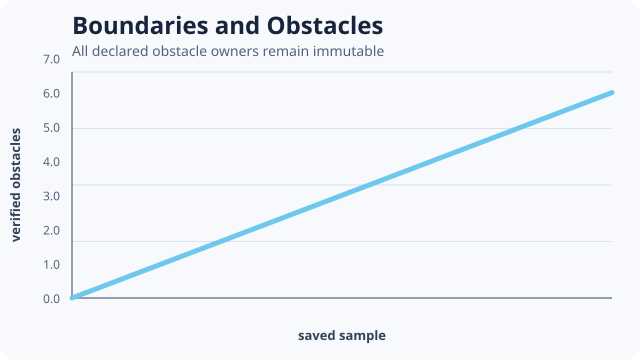

# [Boundaries and Obstacles](@id boundaries-and-obstacles)



This example uses closed ownership boundaries and an immutable vertical obstacle segment. Obstacle
sites remain part of the rectangular array but cannot receive copy attempts.

```@example boundaries-and-obstacles
boundary_run = include(joinpath(
    ENV["POTTS_DOCS_ROOT"], "models", "examples",
    "boundaries_and_obstacles.jl"))
(boundary_run.obstacle_count, boundary_run.immutable_obstacles,
    boundary_run.solution.stats.completed_mcs)
```

The numerical contract checks every obstacle site's final owner against the declared immutable
medium owner. That assertion is stronger than inspecting a wall-colored image.

Closed, periodic, and fixed-exterior faces express different ownership relations. Field boundary
conditions are separate and must be declared on the field. Do not infer one from the other.

Teaching inspiration: boundary-focused workflows in the
[CC3D reference manual](https://compucell3dreferencemanual.readthedocs.io/en/latest/). The model
and source are original.
