# [Follow the Gradient](@id chemotaxis-example)



This example couples a single finite cell to a prescribed scalar field. It is a compact field and
drive example, not a claim about a particular biological assay.

```@example chemotaxis
migration = include(joinpath(
    ENV["POTTS_DOCS_ROOT"], "models", "examples",
    "follow_the_gradient.jl"))
(migration.centroid_x, migration.displacement,
    migration.gradient_direction)
```

The reusable model declares:

- one medium and one migrating cell type;
- a volume constraint;
- pairwise adhesion;
- a cell-centered field with no-flux boundaries and multilinear interpolation;
- a chemotactic drive with an explicit response law and extension/retraction mode.

The problem constructor binds the reusable field declaration to a realized gradient array and
places one connected cell.

The source asserts positive displacement along the declared positive gradient axis. It uses
`BudgetedSequentialCPM(AttemptsPerSite(4))`, making the additional copy-attempt budget explicit
instead of changing the meaning of ordinary `SequentialCPM`.

Change only one interpretation at a time: the `profile` changes the realized field, `sensitivity`
changes drive strength, and the chemotaxis `mode` changes whether extension, retraction, or both
contribute work.

Teaching inspiration: task-oriented migration examples in
[CC3D QuickModels](https://compucell3d.org/QuickModels). The implementation is original and makes
no assay-specific validation claim.
