# [Two Populations Sort](@id differential-adhesion-example)



This example initializes a confluent checkerboard of two populations with lower within-population
contact energy than heterotypic contact energy.

```@example sorting
sorting = include(joinpath(
    ENV["POTTS_DOCS_ROOT"], "models", "examples",
    "two_populations_sort.jl"))
(sorting.initial_contacts, sorting.final_contacts,
    sorting.within_energy, sorting.between_energy)
```

The canonical source reports a heterotypic-contact trace and asserts that the initial condition
contains measurable heterotypic interfaces. Its energy contrast is quantitative:
`between_energy - within_energy == 16`.

The deterministic smoke ends with fewer heterotypic contacts than it starts with. That verifies
the mechanism, statistic, executable source, and one bounded trajectory; it is not a convergence or
equilibrium claim. A scientific sorting study must predeclare its segregation statistic, burn-in
or stopping rule, replicates, algorithm, attempt normalization, temperature, initialization
distribution, and evidence target.

Teaching inspiration: [CC3D QuickModels](https://compucell3d.org/QuickModels). This is a clean
original PottsToolkit implementation, not translated CC3D code.
