# [Elongated Network](@id elongated-network)



This example combines target elongation with a connectivity constraint for four sparse cells. It
teaches coupled shape mechanisms without presenting a validated angiogenesis model.

```@example elongated-network
network = include(joinpath(
    ENV["POTTS_DOCS_ROOT"], "models", "examples",
    "elongated_network.jl"))
(network.target_elongation, network.elongation_trace,
    network.connectivity_preserved)
```

The canonical source asserts model validity, a 100-MCS bounded run, survival of all four finite
cells, and a finite mean bounding-box elongation at every saved state. That observable is a compact
shape indicator for the animation, not a calibrated vascular morphology metric.
`PreserveConnectivity` prevents fragmentation of each cell; it does not guarantee that the
population forms one connected vascular graph.

The media workflow animates this example because temporal shape change is material to the lesson.
A scientific network claim must separately define graph construction, connectivity, branch
length, lacunarity or another statistic, initial distribution, replicates, and uncertainty.

This example is original. Its name describes the visible mechanism portfolio rather than a
published reproduction.
