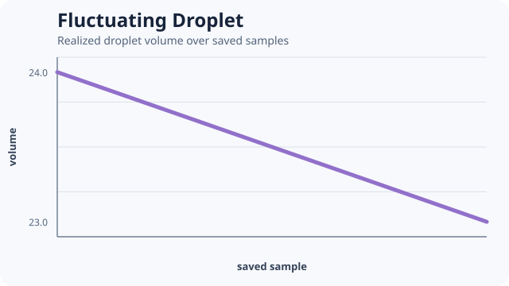

# [Fluctuating Droplet](@id fluctuating-droplet)



A single droplet combines explicit contact energy with fluctuating volume pressure. Mechanical
noise is declared by the component rather than hidden inside a plotting or analysis step.

```@example fluctuating-droplet
droplet = include(joinpath(
    ENV["POTTS_DOCS_ROOT"], "models", "examples",
    "fluctuating_droplet.jl"))
(droplet.volume_trace, droplet.mean_volume, droplet.variance)
```

The source computes the finite-sample volume mean and variance and asserts that the statistic is
well-defined. The pinned smoke commonly produces a nonzero fluctuation; the assertion remains
mathematically correct even if a future compatible run yields zero variance over this short
window.

Do not describe this trace as an equilibrium distribution. Equilibrium requires the separate
algorithm/evidence gate plus declared burn-in, sampling, and convergence analysis.

This is an original PottsToolkit example backed by the reusable `droplet_problem` constructor.
