# [Grow, Divide, Retire](@id growth-division-example)



This example combines volume-target growth, threshold-triggered division, and scheduled retirement.

```@example division
lifecycle = include(joinpath(
    ENV["POTTS_DOCS_ROOT"], "models", "examples",
    "grow_divide_retire.jl"))
(lifecycle.cell_counts, lifecycle.retiring_counts,
    lifecycle.retirement_mcs)
```

The model uses:

- `Growth` to update the target-volume property;
- `PropertyAtLeast` to request division at a declared threshold;
- `RandomOrientationSplit` for division geometry;
- `ImmediateDeath` for explicit retirement of a separately typed seed at MCS 4;
- explicit property inheritance policies during daughter construction.

The assertions require the maximum live-cell count to exceed the initial count and the scheduled
retiring population to fall from one cell to zero. The short threshold and retirement schedule are
chosen for an executable mechanism example, not as biological cell-cycle or death calibration.

Capacity must cover the maximum admitted live population. Exhausting capacity is an error, not an
implicit lattice resize. Cell identity is generation-aware across retirement and slot reuse, so
analysis should join observations by `(cell_id, generation)`.

Teaching inspiration: lifecycle workflows in the
[CC3D reference manual](https://compucell3dreferencemanual.readthedocs.io/en/latest/). The source
is an original PottsToolkit model.
