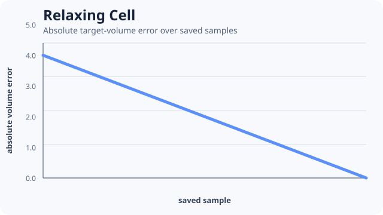

# [Relaxing Cell](@id relaxing-cell)



A single cell begins below its target volume and relaxes under an explicit fluctuating-volume
mechanism. The output is a deterministic volume trace, not merely a picture.

```@example relaxing-cell
relaxation = include(joinpath(
    ENV["POTTS_DOCS_ROOT"], "models", "examples", "relaxing_cell.jl"))
(relaxation.volume_trace, relaxation.absolute_error,
    relaxation.initial_error, relaxation.final_error)
```

The canonical source asserts positive volume throughout the run and records the absolute
target-volume error at every saved time. With the pinned seed and algorithm, this smoke reaches the
declared target in the retained trace.

Use this example to learn:

- the distinction between target and realized volume;
- explicit algorithm temperature;
- complete host snapshots for a small diagnostic trace;
- why deterministic numerical output is stronger than visual plausibility.

The short run is not an equilibrium claim. A fluctuation or equilibrium study needs burn-in,
sampling cadence, a stationary statistic, replicates, and its applicable qualification gate.

Teaching inspiration: the approachable first-cell progression in
[CellularPotts.jl Hello World](https://robertgregg.github.io/CellularPotts.jl/dev/ExampleGallery/HelloWorld/HelloWorld/).
The implementation is clean original PottsToolkit code.
