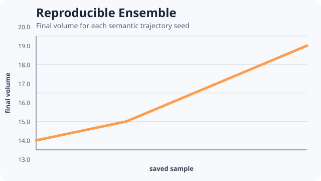

# [Reproducible Ensemble](@id reproducible-ensemble)



Replicates should derive independent semantic seeds through the engine's ensemble policy, not task
order or ad hoc arithmetic.

```@example reproducible-ensemble
ensemble_run = include(joinpath(
    ENV["POTTS_DOCS_ROOT"], "models", "examples",
    "reproducible_ensemble.jl"))
(ensemble_run.seeds, ensemble_run.final_volumes,
    ensemble_run.mean_final_volume)
```

The source requires four distinct derived seeds and positive final cell volume in every
trajectory. `EnsembleSerial` makes the fast example deterministic; the seed policy is designed so
an applicable threaded execution does not redefine trajectory identity.

The displayed mean is descriptive for four tiny smoke trajectories. It is not a confidence
interval or scientific sample-size justification. A study must define its statistic, replicate
count, exclusions, rerun policy, and uncertainty analysis in advance.

Teaching inspiration: complete parameter-scan workflows in
[CC3D QuickModels](https://compucell3d.org/QuickModels). The implementation uses the native
CorePotts ensemble contract.
