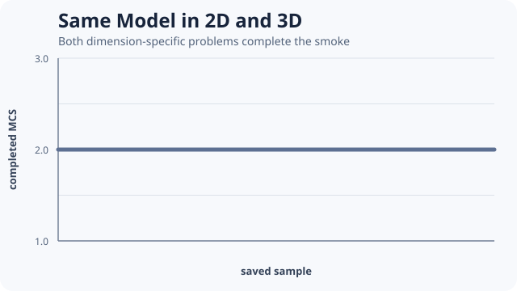

# [Same Model in 2D and 3D](@id same-model-2d-3d)



Reference constructors accept dimension-generic shapes, while realized geometry, volume, and
computational cost remain dimension-specific.

```@example same-model-2d-3d
dimensional = include(joinpath(
    ENV["POTTS_DOCS_ROOT"], "models", "examples",
    "same_model_2d_3d.jl"))
(dimensional.dimensions,
    map(report -> report.qualified, dimensional.reports),
    map(solution -> solution.stats.completed_mcs, dimensional.solutions))
```

The source constructs related two- and three-dimensional fluctuating-cell problems, preflights
both, and requires both bounded runs to complete. It does not claim that equal numeric parameters
have equal physical meaning across dimensions.

For visualization, materialize a full 2D frame or an `OrthogonalSlice` of a 3D state. Record the
slice axis and index with exported output.

Teaching inspiration: the dimension progression in
[CellularPotts.jl Going 3D](https://robertgregg.github.io/CellularPotts.jl/dev/ExampleGallery/Going3D/Going3D/).
The source is original PottsToolkit code.
