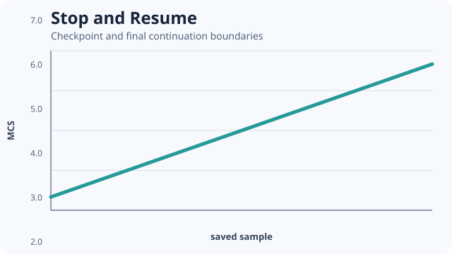

# [Stop and Resume](@id stop-and-resume)



This example proves exact same-contract continuation rather than merely demonstrating that a file
can be read.

```@example stop-and-resume
continuation = include(joinpath(
    ENV["POTTS_DOCS_ROOT"], "models", "examples",
    "stop_and_resume.jl"))
(continuation.checkpoint.mcs, continuation.resumed_mcs,
    continuation.exact_lattice)
```

The source advances three MCS, captures a canonical checkpoint, restores it against the same
problem and algorithm, advances both branches three more MCS, and requires exact lattice equality.

`restore_checkpoint` is the exact-continuation operation. `import_checkpoint` is an explicit new
run with a compatibility report and weaker guarantee. Never replace restore with import silently.

Teaching inspiration: restart-oriented complete projects in the
[CC3D reference manual](https://compucell3dreferencemanual.readthedocs.io/en/latest/). The source
uses Potts.jl's own canonical checkpoint contract.
