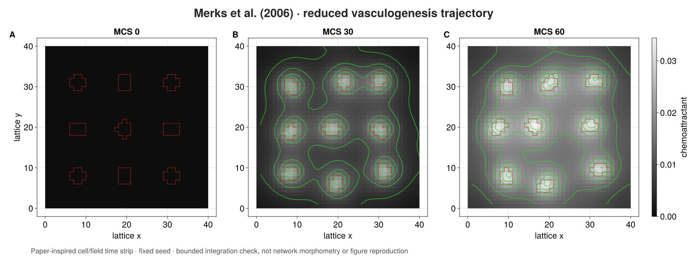

# [Merks 2006](@id merks-2006-case)

> **Content class:** qualified source-bounded case study. **Support level:**
> qualified unpublished internal beta.

**Outcome.** Assemble the reduced Merks vasculogenesis mechanism from ordinary
PottsToolkit declarations and an explicit multirate ProcessBigraph coupling
CPM, secretion, diffusion, decay, and typed observations.

**Prerequisites.** [Adapters and solvers](@ref adapters-and-solvers),
[write components](@ref write-components), and Cellular Potts concepts.

## Source, ambiguity trace, and profiles

Source: Merks et al. (2006), DOI
[`10.1016/j.ydbio.2005.10.003`](https://doi.org/10.1016/j.ydbio.2005.10.003).
The trace covers equations 3–6 and the explicit software choices for periodic
field boundaries, Moore local-connectivity rejection, and deterministic
nonoverlapping placement.

| Choice | Canonical profile | Executed docs profile |
|---|---:|---:|
| Domain | 500×500 | 20×20 |
| Cells | 282 | 2 |
| Initially occupied sites | 28,200 | 10 |
| Target area | 100 | 5 |
| Target length | 50 | 5 |
| Temperature | 50 | 50 |
| Chemotaxis γ | 1000 | 1000 |
| Field subcycles / MCS | 15 | 15 |
| Horizon | bounded qualification | 2 MCS |
| Seed | declared canonical | 11 |

The high-level biological model is shared exactly; domain, population,
targets, runtime, and seed are intentional documentation reductions.

## Complete executed source

The following is the entire program. No reference-model constructor or hidden
scientific setup is used.

```@example merks-2006
using PottsToolkit
using OrdinaryDiffEqTsit5: Tsit5
import CorePotts
import ProcessBigraphs as PB
import SciMLBase

const MERKS_SOURCE_DOI = "10.1016/j.ydbio.2005.10.003"
const MERKS_SEMANTIC_VERSION = "2.0.0"

profile = (
    identity=:reduced_docs_cpu,
    dimensions=(20, 20),
    cells=2,
    central_extent=16,
    target_area_sites=5.0,
    target_length_sites=5.0,
    temperature=50.0,
    chemotaxis_gamma=1000.0,
    volume_strength=50.0,
    source_length_strength=5.0,
    secretion_rate=1.8e-4,
    diffusion=0.1,
    decay=1.8e-4,
    subcycles_per_mcs=15,
    mcs=2,
    seed=UInt64(11),
)

cell = CellType(:endothelial)
extracellular = Medium(:extracellular_matrix)
border = Medium(:border)
chemoattractant = Field(
    :chemoattractant;
    placement=CellCentered(),
    boundary=PeriodicField(),
    interpolation=Nearest(),
)
moore = CorePotts.MooreTopology{2}()
spatial_roles = CorePotts.SpatialRoles(
    proposal=CorePotts.static_relation(CorePotts.ProposalRole(), moore),
    contact=CorePotts.static_relation(CorePotts.ContactRole(), moore),
    surface=CorePotts.static_relation(CorePotts.SurfaceRole(), moore),
    connectivity=CorePotts.static_relation(CorePotts.ConnectivityRole(), moore),
    query=CorePotts.static_relation(CorePotts.SpatialQueryRole(), moore),
)
potts_model = PottsModel(
    cell,
    extracellular,
    border,
    Volume(
        cell => (
            target=profile.target_area_sites,
            strength=profile.volume_strength,
        ),
    ),
    Elongation(
        cell => (
            target=profile.target_length_sites / 4,
            strength=16 * profile.source_length_strength,
        );
        target_division=CloneOnDivision(),
    ),
    Adhesion(PairwiseLaw(
        :contact_energy,
        (cell, cell) => 40.0,
        (cell, extracellular) => 20.0,
        (cell, border) => 100.0,
        (extracellular, extracellular) => 0.0,
        (extracellular, border) => 0.0,
        (border, border) => 0.0,
    )),
    chemoattractant,
    Chemotaxis(
        chemoattractant,
        cell => profile.chemotaxis_gamma / profile.temperature;
        response=LinearResponse(),
        mode=ExtensionChemotaxis(),
    ),
    LocalConnectivity(),
    spatial_roles,
)

function initial_merks_labels(profile)
    labels = zeros(UInt64, profile.dimensions)
    grid_width = ceil(Int, sqrt(profile.cells))
    lower = ntuple(axis ->
        fld(profile.dimensions[axis] - profile.central_extent, 2) + 1, 2)
    spacing = profile.central_extent / grid_width
    radius = sqrt(profile.target_area_sites / pi)
    identity = 0
    for gy in 1:grid_width, gx in 1:grid_width
        identity == profile.cells && break
        identity += 1
        center = (
            lower[1] - 1 + (gx - 0.5) * spacing,
            lower[2] - 1 + (gy - 0.5) * spacing,
        )
        bound = ceil(Int, radius) + 1
        xbounds = (
            max(1, floor(Int, center[1]) - bound):
            min(profile.dimensions[1], ceil(Int, center[1]) + bound)
        )
        ybounds = (
            max(1, floor(Int, center[2]) - bound):
            min(profile.dimensions[2], ceil(Int, center[2]) + bound)
        )
        candidates = [
            CartesianIndex(x, y) for y in ybounds for x in xbounds
        ]
        sort!(candidates; by=site -> (
            sum((site[axis] - center[axis])^2 for axis in 1:2),
            Tuple(site),
        ))
        for site in candidates[1:round(Int, profile.target_area_sites)]
            iszero(labels[site]) ||
                throw(ArgumentError("initial cells overlap"))
            labels[site] = UInt64(identity)
        end
    end
    labels
end

labels = initial_merks_labels(profile)
initial_field = zeros(Float64, profile.dimensions)
field_scale = PB.TimeScale(2, 1, :second)
field_problem = PB.BoundedCartesianFieldProblem(
    "merks-chemoattractant",
    initial_field;
    spacing=(2.0, 2.0),
    diffusion=profile.diffusion,
    decay=profile.decay,
    tick_duration=2.0,
    time_scale=field_scale,
)
field_declaration = PB.sciml_field_declaration(
    field_problem,
    Tsit5();
    algorithm_id="ordinarydiffeq-tsit5",
    solver_options=(abstol=1.0e-9, reltol=1.0e-9),
)
field_process = PB.managed_field_process(
    field_declaration;
    resource_authorization=(
        backend=:cpu,
        precision=:float64,
        residency=:host,
    ),
    subcycles_per_mcs=profile.subcycles_per_mcs,
)

function merks_problem(
        potts_model, cell, chemoattractant, profile, labels, field, mcs)
    identities = Tuple(
        id => cell for id in sort!(collect(Set(filter(!iszero, labels))))
    )
    PottsProblem(
        potts_model,
        CartesianDomain(
            profile.dimensions;
            spacing=(1.0, 1.0),
            boundaries=(
                AxisBoundary(ClosedBoundary()),
                AxisBoundary(ClosedBoundary()),
            ),
        ),
        Layout(LabelledCells(labels, identities));
        fields=(chemoattractant => field,),
        capacity=profile.cells,
        tspan=(mcs - 1, mcs),
        seed=profile.seed,
    )
end

function logical_labels(state, dimensions)
    labels = zeros(UInt64, dimensions)
    for site in eachindex(labels)
        owner = CorePotts.owner_at(state, site)
        labels[site] = CorePotts.is_cell_owner(owner) ?
            UInt64(CorePotts.value(CorePotts.cell_id(owner))) : UInt64(0)
    end
    labels
end

struct MerksCPMStep{M,C,F,P} <: PB.AbstractStep
    model::M
    cell::C
    field::F
    profile::P
end

PB.ports(::MerksCPMStep) = (
    PB.PortSpec(Array{UInt64,2}, :labels, :input;
        interval_behavior=:event_updated),
    PB.PortSpec(Array{Float64,2}, :mcs_field, :input;
        interval_behavior=:event_updated),
    PB.PortSpec(Array{UInt64,2}, :labels_out, :output;
        update_law=:replace),
)
PB.semantic_version(::MerksCPMStep) = MERKS_SEMANTIC_VERSION
PB.semantic_parameters(step::MerksCPMStep) = (
    family=:Merks2006,
    source_doi=MERKS_SOURCE_DOI,
    profile=step.profile.identity,
    potts_fingerprint=semantic_fingerprint(step.model).digest,
)
function PB.invoke(step::MerksCPMStep, inputs, context)
    mcs = Int(div(context.end_time.tick, step.profile.subcycles_per_mcs))
    experiment = merks_problem(
        step.model,
        step.cell,
        step.field,
        step.profile,
        inputs[:labels],
        inputs[:mcs_field],
        mcs,
    )
    integrator = SciMLBase.init(
        experiment,
        SequentialCPM(temperature=step.profile.temperature),
    )
    SciMLBase.step!(integrator)
    updated = logical_labels(
        CorePotts.logical_state(integrator),
        step.profile.dimensions,
    )
    PB.InvocationResult((
        PB.emit(context, :labels_out, PB.ReplaceUpdate(), updated),
    ); diagnostics=(
        mcs,
        accepted_copies=CorePotts.current_mcs_report(integrator).accepted_copies,
    ))
end

struct MerksSecretion <: PB.AbstractStep
    rate::Float64
end

PB.ports(::MerksSecretion) = (
    PB.PortSpec(Array{UInt64,2}, :labels, :input;
        interval_behavior=:event_updated),
    PB.PortSpec(Array{Float64,2}, :forcing, :output;
        update_law=:replace),
    PB.PortSpec(Array{Float64,2}, :decay_weights, :output;
        update_law=:replace),
)
PB.semantic_version(::MerksSecretion) = MERKS_SEMANTIC_VERSION
PB.semantic_parameters(step::MerksSecretion) = (
    family=:Merks2006,
    source_equation=6,
    secretion_rate=step.rate,
)
function PB.invoke(step::MerksSecretion, inputs, context)
    labels = inputs[:labels]
    forcing = map(label -> iszero(label) ? 0.0 : step.rate, labels)
    decay_weights = map(label -> iszero(label) ? 1.0 : 0.0, labels)
    PB.InvocationResult((
        PB.emit(context, :forcing, PB.ReplaceUpdate(), forcing),
        PB.emit(context, :decay_weights, PB.ReplaceUpdate(), decay_weights),
    ))
end

forcing = map(
    label -> iszero(label) ? 0.0 : profile.secretion_rate,
    labels,
)
decay_weights = map(label -> iszero(label) ? 1.0 : 0.0, labels)
composite_model = PB.compose(
    :Merks2006;
    scale=field_scale,
    profile=:reproducible,
) do system
    label_store = PB.store!(system, :labels, PB.LeafSchema(
        UInt64; shape=profile.dimensions, default=labels,
        update_law=:replace, ontology="CPM cell identity"))
    field_store = PB.store!(system, :field, PB.LeafSchema(
        Float64; shape=profile.dimensions, default=initial_field,
        update_law=:replace, units="concentration"))
    mcs_field_store = PB.store!(system, :mcs_field, PB.LeafSchema(
        Float64; shape=profile.dimensions, default=initial_field,
        update_law=:replace, units="concentration"))
    forcing_store = PB.store!(system, :forcing, PB.LeafSchema(
        Float64; shape=profile.dimensions, default=forcing,
        update_law=:replace, units="concentration/second"))
    decay_store = PB.store!(system, :decay_weights, PB.LeafSchema(
        Float64; shape=profile.dimensions, default=decay_weights,
        update_law=:replace))

    field = PB.mount!(system, :field_solver, field_process)
    PB.attach!(system, field, (
        field=field_store,
        forcing=forcing_store,
        decay_weights=decay_store,
        field_out=field_store,
        mcs_field=mcs_field_store,
    ))
    PB.schedule!(system, field, PB.Every(PB.Duration(1, field_scale)))

    cpm = PB.mount!(
        system,
        :cellular_potts,
        MerksCPMStep(potts_model, cell, chemoattractant, profile),
    )
    PB.attach!(system, cpm, (
        labels=label_store,
        mcs_field=mcs_field_store,
        labels_out=label_store,
    ))

    secretion = PB.mount!(
        system,
        :secretion_mask,
        MerksSecretion(profile.secretion_rate),
    )
    PB.attach!(system, secretion, (
        labels=label_store,
        forcing=forcing_store,
        decay_weights=decay_store,
    ))
    PB.schedule!(system, secretion, PB.After(cpm))
    PB.observable!(system, :labels, label_store)
    PB.observable!(system, :field, field_store)
end

struct MerksSummary <: PB.AbstractObserver
    subcycles_per_mcs::Int
end
PB.observer_semantic_version(::MerksSummary) = MERKS_SEMANTIC_VERSION
PB.observer_semantic_parameters(observer::MerksSummary) = (
    family=:Merks2006,
    subcycles_per_mcs=observer.subcycles_per_mcs,
)
function PB.observe(observer::MerksSummary, projection, context)
    labels = projection[PB.path("labels")]
    field = projection[PB.path("field")]
    PB.ObservationResult((
        mcs=Int(div(context.time.tick, observer.subcycles_per_mcs)),
        cells=length(Set(filter(!iszero, labels))),
        occupied=count(!iszero, labels),
        field_mass=sum(field),
        field_minimum=minimum(field),
        field_maximum=maximum(field),
    ))
end

observer = PB.ObserverSpec(
    "merks-state-summary",
    MerksSummary(profile.subcycles_per_mcs),
    (PB.path("labels"), PB.path("field")),
    PB.PeriodicObservationSchedule(
        PB.Duration(profile.subcycles_per_mcs, field_scale),
    );
    record_schema=PB.RecordSchema(
        NamedTuple; identity="merks-state-summary-v2"),
)
runtime = PB.initialize_runtime(
    PB.compile(composite_model),
    PB.SerialExecutor(
        root_seed=profile.seed,
        observation_plan=PB.ObservationPlan((observer,)),
    ),
)
horizon = PB.LogicalTime(
    profile.mcs * profile.subcycles_per_mcs,
    field_scale,
)
PB.run_until!(runtime, horizon)

records = Tuple(record.payload for record in PB.observation_records(runtime))
result = (
    final=last(records),
    model_fingerprint=semantic_fingerprint(potts_model).digest,
    composite_fingerprint=PB.semantic_fingerprint(composite_model),
    source_doi=MERKS_SOURCE_DOI,
)
@assert length(records) == profile.mcs
@assert 0 < result.final.cells <= profile.cells
@assert result.final.occupied > 0
@assert result.final.field_mass > 0
@assert result.final.field_minimum >= 0
```

## State, trace, and inspection loop




<div class="pb-native-animation">
<video autoplay loop muted playsinline controls preload="metadata"
       width="1800" height="820"
       poster="../assets/merks-state.png"
       aria-label="Native MakiePotts animation of the fixed-seed reduced Merks trajectory from initialization through MCS sixty">
  <source src="../assets/merks-animation.mp4" type="video/mp4">
  <a href="../assets/merks-animation.mp4">Download the Merks Makie animation.</a>
</video>

</div>

Text alternative for the animation: thirteen native MakiePotts states sample a
fixed-seed 40 × 40, nine-cell visualization profile every 5 MCS through MCS 60.
Red cell boundaries remain visible over the grayscale chemoattractant field;
green contours reveal the evolving local and shared field structure.
Reduced-motion users receive the three-panel MCS 0/30/60 time strip. The
executed two-MCS program above remains the compact, fully displayed tutorial
and typed-record authority. This longer profile is a paper-inspired mechanism
visualization, not a reproduction of the paper’s lacuna, branch-length, or
ensemble morphometry.

## What this establishes

The displayed program establishes:

- explicit volume, elongation, adhesion, field, chemotaxis, local-connectivity,
  and Moore spatial-role declarations;
- deterministic nonoverlapping placement for the reduced two-cell profile;
- explicit stores and wiring for labels, field, MCS-visible field, forcing, and
  decay weights;
- a real Tsit5 field adapter with visible tolerances and CPU authorization;
- 15 field publications per CPM step, followed by secretion-mask refresh;
- typed cell-count, occupied-site, and field-range/mass observations; and
- exact Potts semantic identity and fixed-seed bounded outputs with the packaged
  reduced Merks model.

The CPM is stochastic. Exact equality here means that the displayed and
packaged assemblies use the same seed, MCS clock, initial state, and solver
path. It is not evidence that one trajectory characterizes the output
distribution.

## What this does not establish

It does **not** reproduce Figure 5, perform morphometry, estimate an ensemble or
distribution, validate the canonical 500×500/282-cell run from this page,
establish physical time calibration, prove solver independence, or imply
source-author endorsement. In this small fixed-seed trajectory, one initially
five-site identity has no occupied sites by MCS 2; that observation is not a
cell-survival conclusion.

**Material defaults.** Every scientific and execution value appears in
`profile`, the field declaration, or the explicit CPM algorithm call.

**Expected result.** Two typed observations; cell counts `2` then `1`; occupied
site counts `5` then `1`; increasing, nonnegative field mass; and stable
model/composite identities for seed 11.

**Backend / runtime / seed.** CPU/Float64/host; 30 field ticks = 2 bounded MCS;
seed 11.

**Reproduction command.**
`julia --project=lib/ProcessBigraphs/docs lib/ProcessBigraphs/docs/models/case_studies/merks_2006.jl`

**Full qualification command.**
`julia --project=. -e 'using Pkg; Pkg.test("PottsToolkit")'`

**Next step.** Audit [engines and compute ownership](@ref engines-and-compute)
or return to the [case-study boundary](@ref case-studies-index).
