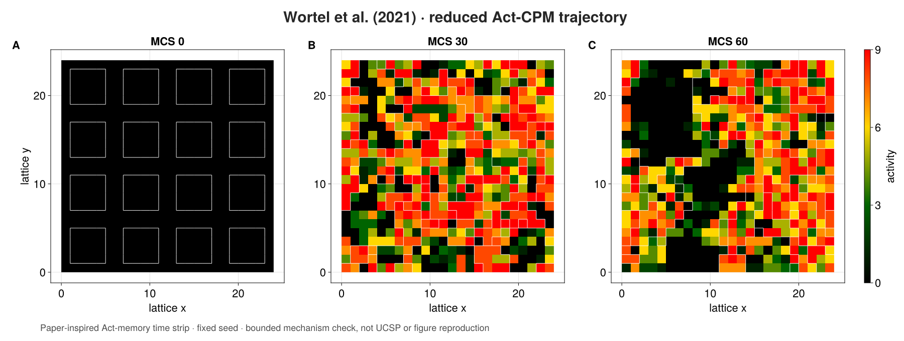
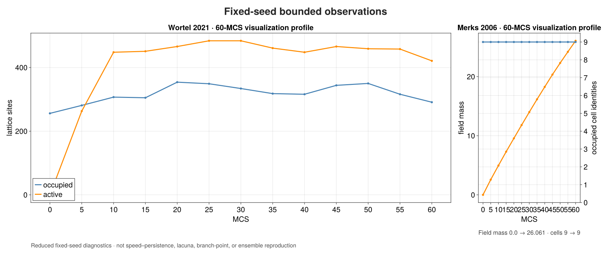

# [Wortel 2021](@id wortel-2021-case)

> **Content class:** qualified source-bounded case study. **Support level:**
> qualified unpublished internal beta.

**Outcome.** Assemble the reduced Wortel activity-CPM mechanism from ordinary
PottsToolkit declarations, execute it through an explicit ProcessBigraph, and
record a typed bounded-state summary.

**Prerequisites.** [Your first multirate composite](@ref first-multirate-composite),
[write components](@ref write-components), and familiarity with Cellular Potts
models.

## Source and accepted profile

Source: Wortel et al. (2021), DOI
[`10.1016/j.bpj.2021.04.036`](https://doi.org/10.1016/j.bpj.2021.04.036).
The traced mechanism is the geometric Act memory term with a Moore
neighborhood and explicit activity parameters.

| Choice | Reduced docs profile |
|---|---|
| Domain | 24×24 lattice |
| Initial cells | deterministic 4×4 blocks |
| Activity | maximum 10, strength 20 |
| Volume | target 16, strength 1 |
| Temperature | 20 |
| CPM budget | one attempt per site per MCS |
| Observation cadence | 2 MCS |
| Horizon | 4 MCS |
| Seed | `0x7068617365313403` |
| Backend | CPU |

Deviations are the reduced domain, short horizon, and documentation seed.

## Complete executed source

This is the entire program. The biological declarations, initialization, Act
mechanism, ProcessBigraph stores, component, bindings, schedule, observer,
runtime, and assertions are all visible and evaluated.

```@example wortel-2021
using PottsToolkit
import CorePotts
import ProcessBigraphs as PB
import SciMLBase

const WORTEL_SOURCE_DOI = "10.1016/j.bpj.2021.04.036"
const WORTEL_SEMANTIC_VERSION = "1.0.0"

profile = (
    identity=:reduced_cpu,
    dimensions=(24, 24),
    cell_side=4,
    maximum_activity=10.0f0,
    activity_strength=20.0f0,
    volume_strength=1.0f0,
    temperature=20.0f0,
    observation_every=2,
    mcs=4,
    seed=UInt64(0x7068617365313403),
)

medium = Medium(:extracellular)
cell = CellType(:endothelial)
potts_model = PottsModel(
    medium,
    cell,
    Volume(
        cell => (
            target=Float32(profile.cell_side^2),
            strength=profile.volume_strength,
        ),
    ),
    Adhesion(PairwiseLaw(
        :contact_energy,
        (medium, medium) => 0.0f0,
        (medium, cell) => 6.0f0,
        (cell, cell) => 2.0f0,
    )),
)
activity = Act(
    maximum_activity=profile.maximum_activity,
    strength=profile.activity_strength,
    neighborhood=CorePotts.MooreTopology{2}(),
    spacing=(1.0f0, 1.0f0),
    algorithm=BudgetedSequentialCPM(
        AttemptsPerSite(1);
        temperature=profile.temperature,
    ),
    observation_every=profile.observation_every,
)

function initial_wortel_labels(profile)
    labels = zeros(UInt64, profile.dimensions)
    pitch = profile.cell_side + 2
    identity = UInt64(0)
    for y in 2:pitch:(profile.dimensions[2] - profile.cell_side),
            x in 2:pitch:(profile.dimensions[1] - profile.cell_side)
        identity += UInt64(1)
        labels[
            x:(x + profile.cell_side - 1),
            y:(y + profile.cell_side - 1),
        ] .= identity
    end
    labels
end
labels = initial_wortel_labels(profile)
identities = Tuple(
    id => cell for id in sort!(collect(Set(filter(!iszero, labels))))
)
base_problem = PottsProblem(
    potts_model,
    CartesianDomain(profile.dimensions; spacing=(1.0f0, 1.0f0)),
    Layout(LabelledCells(labels, identities));
    capacity=length(identities),
    tspan=(0, profile.mcs),
    seed=profile.seed,
)
activity_problem = CorePotts.ActivityPottsProblem(
    base_problem,
    lower(activity),
)

function activity_arrays(problem, dimensions, mcs)
    integrator = SciMLBase.init(problem)
    SciMLBase.step!(integrator, mcs)
    state = CorePotts.logical_state(integrator)
    labels = zeros(UInt64, dimensions)
    activity = zeros(Float32, dimensions)
    for site in eachindex(labels)
        owner = CorePotts.owner_at(state, site)
        labels[site] = CorePotts.is_cell_owner(owner) ?
            UInt64(CorePotts.value(CorePotts.cell_id(owner))) : UInt64(0)
        activity[site] =
            Float32(CorePotts.site_property_value(integrator, site))
    end
    return labels, activity, CorePotts.current_mcs_report(integrator)
end

struct WortelActivityBatch{P,T} <: PB.AbstractProcess
    problem::P
    profile::T
    model_fingerprint::String
end

PB.ports(::WortelActivityBatch) = (
    PB.PortSpec(Array{UInt64,2}, :labels, :output; update_law=:replace),
    PB.PortSpec(Array{Float32,2}, :activity, :output; update_law=:replace),
)
PB.semantic_version(::WortelActivityBatch) = WORTEL_SEMANTIC_VERSION
PB.semantic_parameters(batch::WortelActivityBatch) = (
    family=:Wortel2021,
    source_doi=WORTEL_SOURCE_DOI,
    profile=batch.profile.identity,
    potts_fingerprint=batch.model_fingerprint,
)
function PB.invoke(batch::WortelActivityBatch, inputs, context)
    labels, activity, report = activity_arrays(
        batch.problem,
        batch.profile.dimensions,
        batch.profile.mcs,
    )
    PB.InvocationResult((
        PB.emit(context, :labels, PB.ReplaceUpdate(), labels),
        PB.emit(context, :activity, PB.ReplaceUpdate(), activity),
    ); diagnostics=(
        accepted_copies=report.accepted_copies,
        profile=batch.profile.identity,
    ))
end

scale = PB.TimeScale(1, 1, :mcs)
composite_model = PB.compose(
    :Wortel2021;
    scale,
    profile=:reproducible,
) do system
    label_store = PB.store!(
        system, :labels,
        PB.LeafSchema(
            UInt64;
            shape=profile.dimensions,
            default=zeros(UInt64, profile.dimensions),
            update_law=:replace,
            ontology="CPM cell identity",
        ),
    )
    activity_store = PB.store!(
        system, :activity,
        PB.LeafSchema(
            Float32;
            shape=profile.dimensions,
            default=zeros(Float32, profile.dimensions),
            update_law=:replace,
            ontology="Act memory",
        ),
    )
    simulation = PB.mount!(
        system,
        :activity_cpm,
        WortelActivityBatch(
            activity_problem,
            profile,
            semantic_fingerprint(potts_model).digest,
        ),
    )
    PB.attach!(
        system,
        simulation,
        (labels=label_store, activity=activity_store),
    )
    PB.schedule!(
        system,
        simulation,
        PB.At(PB.LogicalTime(profile.mcs, scale)),
    )
    PB.observable!(system, :labels, label_store)
    PB.observable!(system, :activity, activity_store)
end

struct WortelSummary <: PB.AbstractObserver end
PB.observer_semantic_version(::WortelSummary) = WORTEL_SEMANTIC_VERSION
PB.observer_semantic_parameters(::WortelSummary) = (
    family=:Wortel2021,
    observation=:bounded_state_summary,
)
function PB.observe(::WortelSummary, projection, context)
    labels = projection[PB.path("labels")]
    activity = projection[PB.path("activity")]
    PB.ObservationResult((
        mcs=Int(context.time.tick),
        cells=length(Set(filter(!iszero, labels))),
        occupied=count(!iszero, labels),
        active_sites=count(>(0), activity),
        activity_mass=sum(activity),
    ))
end

observer = PB.ObserverSpec(
    "wortel-state-summary",
    WortelSummary(),
    (PB.path("labels"), PB.path("activity")),
    PB.AtTimesObservationSchedule((
        PB.LogicalTime(profile.mcs, scale),
    ));
    record_schema=PB.RecordSchema(
        NamedTuple; identity="wortel-state-summary-v1"),
)
runtime = PB.initialize_runtime(
    PB.compile(composite_model),
    PB.SerialExecutor(
        root_seed=profile.seed,
        observation_plan=PB.ObservationPlan((observer,)),
    ),
)
PB.run_until!(runtime, PB.LogicalTime(profile.mcs, scale))

record = only(PB.observation_records(runtime)).payload
result = (
    record,
    model_fingerprint=semantic_fingerprint(potts_model).digest,
    composite_fingerprint=PB.semantic_fingerprint(composite_model),
    source_doi=WORTEL_SOURCE_DOI,
)
@assert result.record.mcs == profile.mcs
@assert result.record.cells == length(identities)
@assert result.record.occupied > 0
```

## State, trace, and inspection loop





```@raw html
<div class="pb-native-animation">
<video autoplay loop muted playsinline controls preload="metadata"
       width="1800" height="820"
       poster="../../assets/wortel-state.png"
       aria-label="Native MakiePotts animation of the fixed-seed reduced Wortel trajectory from MCS zero through sixty">
  <source src="../../assets/wortel-animation.mp4" type="video/mp4">
  <a href="../../assets/wortel-animation.mp4">Download the Wortel Makie animation.</a>
</video>

</div>
```

Text alternative for the animation: thirteen native MakiePotts states sample
the declared seed every 5 MCS from initialization through MCS 60. White cell
boundaries evolve over an activity field that runs from black (inactive)
through green and yellow to red (most active). Reduced-motion users receive the
three-panel MCS 0/30/60 time strip. The executed four-MCS program above remains
the fast, fully displayed tutorial and typed-record authority; the longer media
profile changes only the observation horizon and sampling cadence so that the
stochastic dynamics are legible during a presentation.

## What this establishes

The displayed program establishes that the reduced profile:

- constructs the intended Potts volume/contact model and explicit Act mechanism;
- uses the supported `ActivityPottsProblem` and SciML lifecycle;
- publishes labels and activity through a typed ProcessBigraph component;
- records cell count, occupied sites, active sites, and activity mass at 4 MCS;
- reproduces the same stochastic trajectory for the stated seed on CPU; and
- shares the packaged family’s Potts semantic fingerprint and frozen bounded
  behavior check.

## What this does not establish

It does **not** reproduce Figure 2, execute the paper’s 51-parameter × 30-seed
study, estimate an ensemble or output distribution, validate physical time,
establish backend equivalence from this docs run, or imply endorsement by the
source authors. Exact package/tutorial equality is fixed-seed reproducibility,
not a claim that one stochastic trajectory characterizes the model.
Separate retained qualification covers the same Act mechanism on CPU, Metal,
and ROCm at its frozen evidence boundary; this page executes CPU only.

**Material defaults.** All values are listed in the accepted-profile table and
in `profile` at the top of the program.

**Expected result.** One observation at 4 MCS with the initialized cell count,
positive occupied sites, deterministic fingerprints, and a complete MCS report.

**Backend / runtime / seed.** CPU; four bounded MCS; seed
`0x7068617365313403`.

**Reproduction command.**
`julia --project=lib/ProcessBigraphs/docs lib/ProcessBigraphs/docs/models/case_studies/wortel_2021.jl`

**Full qualification command.**
`julia --project=. -e 'using Pkg; Pkg.test("PottsToolkit")'`

**Next step.** Compare the more tightly coupled field/CPM assembly in
[Merks 2006](@ref merks-2006-case).
