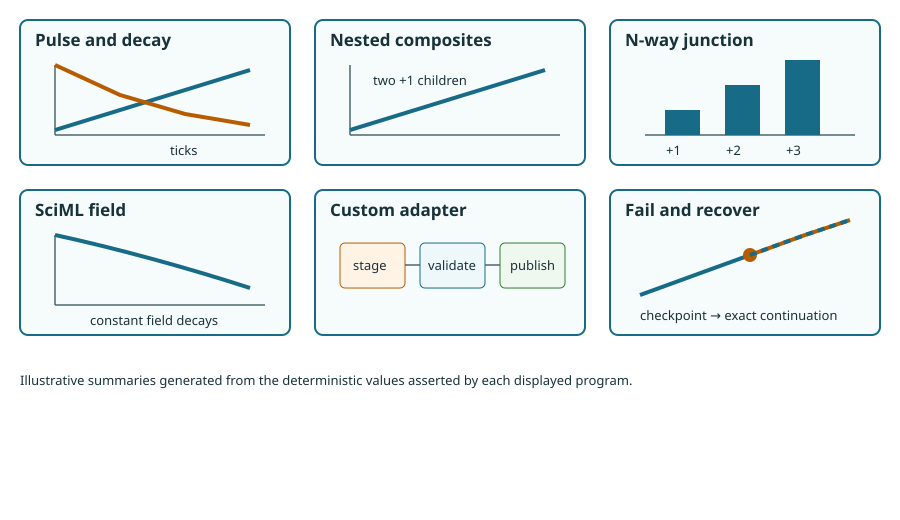

# [Example gallery](@id examples-index)

> **Support level:** all six programs use the qualified unpublished internal
> beta and execute in the pinned docs environment.

These examples are complete, standalone, and deliberately small. Each page
shows every import, extension type, store, port, connection, schedule,
authorization, run command, assertion, and material default.

| Program | Question answered | Warm budget |
|---|---|---:|
| [Pulse and decay](@ref pulse-and-decay) | How do two update laws publish? | 15 s |
| [Reusable nested composites](@ref nested-composites) | How is a definition mounted twice? | 15 s |
| [N-way junctions](@ref n-way-junctions) | How do three explicit producers share state? | 15 s |
| [SciML field adapter](@ref sciml-field-adapter-example) | How does a real solver cross the engine boundary? | 15 s |
| [Independent custom engine adapter](@ref custom-engine-adapter) | What must an extension author implement? | 15 s |
| [Divide, fail, and recover](@ref divide-fail-recover) | How do templates and a settled cut support recovery? | 15 s |

The figures summarize bounded program output; they do not extend the claims
made by the assertions.
