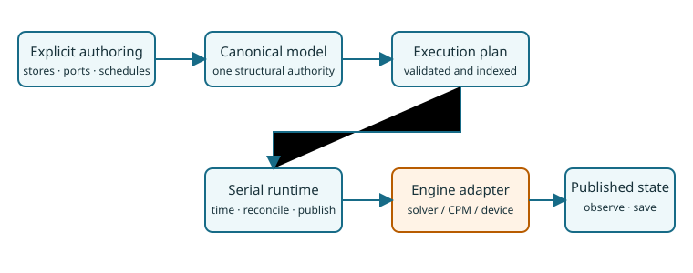

# [The process-bigraph mental model](@id mental-model)

> **Support level:** qualified unpublished internal beta.

**Outcome.** See the complete path from typed stores and ports to one validated
canonical structure and an indexed execution plan.

**Prerequisites.** [Install and verify](@ref install-and-verify).

## Five explicit ideas

1. A **store** declares persistent typed state.
2. A **component** declares ports and behavior.
3. A **connection** binds one named port to one compatible store.
4. A **schedule** says when a temporal process becomes due.
5. Compilation lowers this authoring meaning to one canonical structure and one
   execution plan. Runtime state is not another model authority.



## Complete executed source

```@example mental-model
using ProcessBigraphs
import ProcessBigraphs: AbstractProcess, ports, semantic_version,
    semantic_parameters, invoke

struct MentalPulse <: AbstractProcess
    amount::Int
end

ports(::MentalPulse) = (
    InputPort(Int, :current),
    OutputPort(Int, :increment; update_law=:add),
)
semantic_version(::MentalPulse) = "1.0.0"
semantic_parameters(pulse::MentalPulse) = (amount=pulse.amount,)
invoke(pulse::MentalPulse, inputs, context) = InvocationResult((
    emit(context, :increment, AdditiveUpdate(), pulse.amount),
))

scale = TimeScale(1)
model = compose(:MentalModel; scale) do system
    count = store!(
        system, :count,
        LeafSchema(Int; default=0, update_law=:add),
    )
    pulse = mount!(system, :pulse, MentalPulse(2))
    connect!(system, pulse.current, count)
    connect!(system, pulse.increment, count)
    schedule!(system, pulse, Every(Duration(1, scale)))
    observable!(system, :count, count)
end

report = validate(model)
plan = compile(model)
result = (
    valid=isempty(report.diagnostics),
    model=semantic_fingerprint(model),
    structure=structural_fingerprint(plan),
    execution=plan_fingerprint(plan),
)
```

`mount!` did not connect or schedule `pulse`; each relationship is visible.
The three fingerprints remain distinct because authoring identity, canonical
structure, and execution policy answer different questions.

**Material defaults.** Integer additive state, cadence 1, amount 2, interactive
authoring profile.

**Expected result.** Validation is empty and each semantic layer has a stable
identity.

**Establishes.** Explicit authoring and deterministic lowering.

**Does not establish.** No runtime or numerical-backend claim.

**Backend / runtime / seed.** CPU host; compile only; no seed.

**Reproduction command.**
`julia --project=lib/ProcessBigraphs/docs lib/ProcessBigraphs/docs/models/learn/mental_model.jl`

**Next step.** [Build the first multirate composite](@ref first-multirate-composite).
